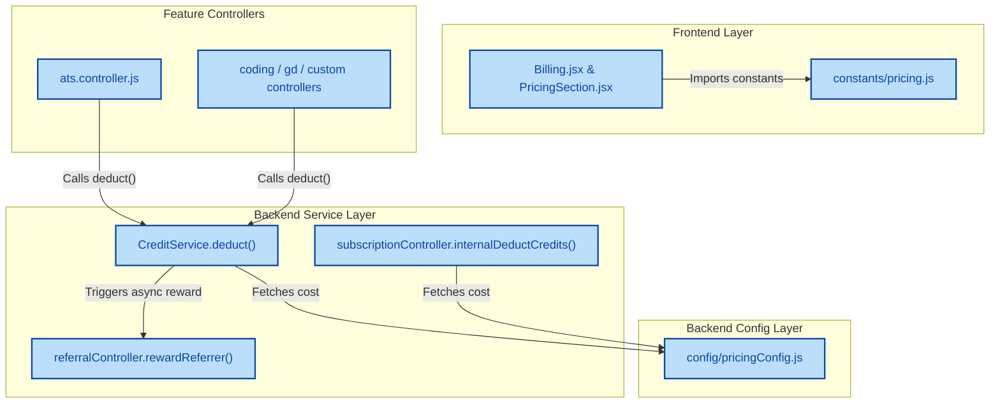

last updated: 2026-04-13
## 1. High-Level Summary (TL;DR)
*   **Impact:** High - Completely overhauls the platform's pricing model, credit allocation, feature costs, and referral reward logic.
*   **Key Changes:**
    *   **Centralized Configuration:** Moved all pricing, credit limits, and service costs out of controllers into dedicated config files (`pricingConfig.js` on backend, `pricing.js` on frontend).
    *   **Credit Inflation & Cost Rebalance:** Increased base credits for all subscription tiers, but proportionally increased the credit cost of platform features (e.g., Mock Interviews now cost 20 credits instead of 10).
    *   **Referral System Overhaul:** Switched referral rewards from "free sessions" to a flat 50-credit reward. The reward is now automatically granted to the referrer upon the referee's first paid action.
    *   **Infinite Elite Adjustments:** Changed the unlimited benefits for the top tier. It now provides unlimited Mock Interviews and GD Sessions, but ATS Scans are now charged.

## 2. Visual Overview (Code & Logic Map)

## 3. Detailed Change Analysis

### 💰 Pricing & Credit Configuration
*   **What Changed:** Replaced hardcoded credit values across the application with centralized config files. Implemented `toNumber` helpers to parse environment variables safely with new updated default values. (Source: `backend/config/pricingConfig.js`, `frontend/src/constants/pricing.js`).

| Subscription Tier | Old Credits | New Credits | Price (Monthly) |
| :--- | :--- | :--- | :--- |
| **Free** | 30 | **60** | ₹0 |
| **Student Flash** | 200 | **260** | ₹199 |
| **Placement Pro** | 600 | **750** | ₹499 |
| **Infinite Elite** | 1200 | **1700** | ₹899 |

| Service / Feature | Old Credit Cost | New Credit Cost |
| :--- | :--- | :--- |
| **Mock Interview** | 10 | **20** |
| **GD Session** | 8 | **30** |
| **ATS Scanner** | 5 | **10** |
| **Tools Use** | 5 | **6** |

### 🎁 Referral System Updates (`referralController.js`)
*   **What Changed:** The reward system was unified. Previously, referees and referrers received arbitrary "+1 Interview and +1 GD session" flags. Now, they both receive a flat **50 Credits** (`REFERRAL_REWARD = 50`). 
*   **Trigger Logic:** The `rewardReferrer(userId)` function is now injected into the main `CreditService.deduct()` flow and the ATS scanner flow. Once a newly referred user spends their first credits, the referrer's account is automatically credited in the background.

### 💳 Credit Service & Subscription Logic (`creditService.js`, `subscriptionController.js`)
*   **What Changed:** 
    *   `internalDeductCredits` and `CreditService.deduct` now dynamically look up costs using `getServiceCost(service, tier)`.
    *   **Infinite Elite Adjustments:** The `isUnlimitedTierService` helper was updated. Infinite Elite users now get unlimited `mock_interview` and `gd_session` usage, but they will be charged standard credits for `ats_scanner` and `tools` (previously, ATS scans were free for them).
    *   **JSON Serialization Fix:** Handled an issue where `Infinity` limits (e.g., unlimited resumes) were crashing the frontend. They are now explicitly converted to `null` before sending the API response.

### 🖥️ Frontend Billing Updates (`Billing.jsx`)
*   **What Changed:** Removed hardcoded top-up arrays. The billing page now calculates the "Low on credits" warning dynamically by checking if the user's balance is lower than `FEATURE_COSTS.mockInterview` (20 credits). Top-up prices and credit yields were proportionally increased.

| Top-Up Plan | Old Price / Credits | New Price / Credits |
| :--- | :--- | :--- |
| **Quick Boost** | ₹29 / 30 | **₹39 / 40** |
| **Power Pack** | ₹49 / 70 | **₹79 / 90** |
| **Pro Master** | ₹99 / 200 | **₹149 / 230** |

## 4. Impact & Risk Assessment
*   **⚠️ Breaking Changes:**
    *   **Infinite Elite Downgrade on ATS:** Users on the top tier who expect unlimited ATS scanning will now face credit deductions. This should be communicated to existing customers.
    *   **GD Session Cost Spike:** The cost of a GD Session jumped from 8 to 30 credits (a nearly 4x increase). Users on lower tiers will exhaust their credits much faster.
*   **🧪 Testing Suggestions:**
    *   **Referral Flow:** Test the complete end-to-end referral cycle: User A shares code -> User B signs up (verify +50 credits) -> User B runs an ATS Scan -> User A receives +50 credits automatically.
    *   **Infinite Elite Exclusions:** Run an ATS Scan as an Infinite Elite user and verify that exactly 10 credits are deducted, while Mock Interviews deduct 0.
    *   **Zero/Negative Balances:** Attempt to trigger a GD Session with exactly 20 credits to ensure the centralized `Insufficient credits` block correctly rejects the request.