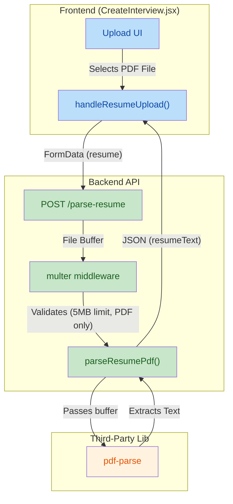
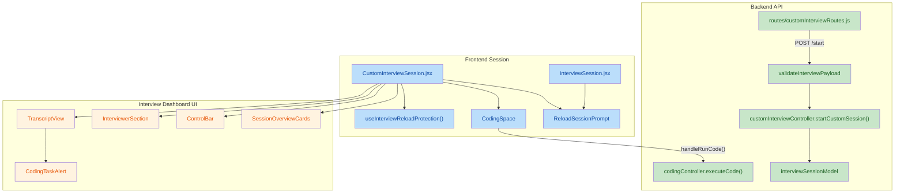

updated on 2026-04-13
## 1. High-Level Summary (TL;DR)
*   **Impact:** Medium - Introduces a new backend API for parsing PDF resumes and enhances the frontend to support file uploads, improving the user experience for interview setup.
*   **Key Changes:**
    *   ✨ **PDF Upload Endpoint:** Added a new backend route (`/parse-resume`) utilizing `multer` and `pdf-parse` to extract text from uploaded resumes.
    *   ✨ **Frontend Integration:** Updated the `CreateInterview` page to allow users to directly upload PDF files instead of relying purely on text input.
    *   🎨 **UI/UX Tweaks:** Improved text contrast across multiple components by updating Tailwind classes (e.g., changing `text-zinc-500` to `text-zinc-400`).
    *   🗑️ **Cleanup:** Removed the "Support & Policy" footer section from the `Billing` page.

## 2. Visual Overview (Code & Logic Map)

The following diagram illustrates the newly introduced PDF upload and parsing flow:

## 3. Detailed Change Analysis

### 📁 Backend: Custom Interview API
*   **What Changed:** Added a new controller and route to handle file uploads securely and extract text content from PDFs.
*   **API Additions:**

| Method | Endpoint | Middleware | Controller | Description |
|---|---|---|---|---|
| `POST` | `/parse-resume` | `userAuth`, `multer` | `parseResumePdf` | Accepts a PDF file (`resume`), checks limits (5MB), and returns the parsed raw text using `pdf-parse`. |

*   **Dependencies:**

| Package | Action | Reason |
|---|---|---|
| `pdf-parse` | Added | Required to extract raw text strings from PDF buffers. |
| `multer` | Added | Required to handle `multipart/form-data` uploads securely in memory. |

### 📁 Frontend: Create Interview Page (`CreateInterview.jsx`)
*   **What Changed:**
    *   Introduced the `handleResumeUpload` method to manage file selection, size validation (< 5MB), and API communication.
    *   Added states `resumeFileName` and `isParsingResume` to handle UI loading states.
    *   Modified the `handleStart` validation logic to ensure users have either uploaded a resume or provided a Job Description before proceeding.
    *   *(Source: `frontend/src/pages/CreateInterview.jsx`)*

### 📁 Frontend: UI Adjustments & Cleanup (`Billing.jsx`, `GroupDiscussionSetup.jsx`)
*   **What Changed:**
    *   **Billing Page:** Removed the "Support & Policy" and "Payment Issues" footer completely to streamline the view.
    *   **Text Contrast:** Changed multiple instances of `text-zinc-500` to `text-zinc-400` in both `CreateInterview` and `GroupDiscussionSetup` components to ensure text is more readable against dark backgrounds.
    *   **Status Indicator:** Changed the active camera/mic pulse indicator color from `bg-emerald-500` to the brand color `bg-[#bef264]`.

## 4. Impact & Risk Assessment
*   ⚠️ **Security Risks:** The introduction of file uploads introduces potential risks. However, this is mitigated by the `multer` configuration which strictly enforces a `5MB` size limit and filters for the `application/pdf` MIME type.
*   **Breaking Changes:** None. The previous text-based input logic appears to gracefully coexist with the new upload flow.
*   🧪 **Testing Suggestions:**
    *   **Upload Validation:** Attempt to upload non-PDF files (e.g., `.docx`, `.png`) to verify the frontend and backend properly reject them.
    *   **Size Constraint:** Attempt to upload a PDF larger than 5MB to ensure the `multer` limit correctly triggers an error response.
    *   **Flow Verification:** Start an interview using the "Both" context source (Resume + Job Description) to ensure the parsed PDF text concatenates correctly with the manual JD input.

## 1. High-Level Summary (TL;DR)
*   **Impact:** High - Introduces major new features including skills-based custom interviews, robust code execution with standard input (stdin) support, interview reload protection, and an extensive UI/UX overhaul of the interview dashboard.
*   **Key Changes:**
    *   ✨ **Skills-Based Interviews:** Added support for selecting skills and specifying `interviewMode` (`roleBased` or `skillsBased`), complete with strict backend payload validation.
    *   ✨ **Terminal Stdin Support:** Added a standard input (`stdin`) text area to the Coding Space terminal, allowing candidates to provide input for code execution.
    *   🛡️ **Interview Reload Protection:** Implemented a new React hook and prompt to prevent accidental session reloads (e.g., hitting F5) and potential data loss during live interviews.
    *   🎨 **UI/UX Overhaul:** Completely redesigned session overview cards, control bars, the interviewer section, and transcript views for better readability and responsive design.

## 2. Visual Overview (Code & Logic Map)

## 3. Detailed Change Analysis

### 🛠️ Interview Creation & Backend Logic
*   **What Changed:** Introduced `interviewMode` (`roleBased` vs `skillsBased`) and tracking for custom/preset skills. Created a robust validation middleware (`validateInterviewPayload.js`) that enforces rules like checking maximum content length (12,000 chars) and ensuring skills are provided if `skillsBased` mode is selected.
*   **Database Schema Changes:** (Source: `interviewSessionModel.js`)

| Field | Type | Default | Description |
|---|---|---|---|
| `userName` | String | `"Candidate"` | Name of the interviewee |
| `interviewMode` | Enum | `"roleBased"` | Mode of interview (`"roleBased"`, `"skillsBased"`) |
| `sourceType` | String | `"resume-job-description"`| Context data source |
| `skills` | `[String]` | `[]` | Array of skill strings for skills-based mode |

*   **API Middleware Updates:** (Source: `customInterviewRoutes.js`)

| Endpoint | Method | Middleware Added | Description |
|---|---|---|---|
| `/start` | POST | `validateInterviewPayload` | Added payload validation before creating the custom session in the DB |

### 💻 Code Execution & Terminal
*   **What Changed:** Upgraded `CodingSpace.jsx` with an `enableTerminalInput` prop. When active, candidates can input standard text (`stdin`) which is packaged and sent to `codingController.js` via the API.
*   **Language Restrictions:** During an active interview, language selection is now disabled, restricting the user to the configured supported languages.

### 🛡️ Interview Reload Protection
*   **What Changed:** Added `useInterviewReloadProtection.js` to intercept window reload events (F5, Ctrl+R, or tab close) during an active interview session.
*   **User Prompt:** Introduced `ReloadSessionPrompt.jsx` to explicitly warn users that reloading will reset their live interview session. 

### 🎨 UI Revamp (Dashboard & Controls)
*   **Session Overview Cards:** (Source: `SessionOverviewCards.jsx`) Completely redesigned from a dark, transparent UI to a solid, high-contrast primary-colored UI layout.
*   **Control Bar:** (Source: `ControlBar.jsx`) Enhanced spacing, padding, responsive behavior (mobile scaling), and added precise hover tooltips.
*   **Interviewer Section:** (Source: `InterviewerSection.jsx`) Added visual overlays indicating connection states ("Connecting Session") and "Interview Tips" while waiting for the transcript to initialize. Included avatar fallbacks for when the user's video is turned off.
*   **Transcript View & Alerts:** (Source: `TranscriptView.jsx`, `CodingTaskAlert.jsx`) Moved the coding popup directly into the transcript view. Added an "Action Disabled" state to prevent users from skipping or attempting challenges while the AI agent is actively speaking.

## 4. Impact & Risk Assessment
*   ⚠️ **Breaking Changes:** 
    *   The new `validateInterviewPayload` middleware introduces strict constraints. Creating an interview with a payload exceeding 12,000 characters or missing required text for a specific `sourceType` will now return a `400 Bad Request`.
*   🐛 **Testing Suggestions:**
    *   **Skills-Based Generation:** Create an interview in "Skills-based" mode, select multiple preset skills, add custom skills, and ensure the prompt correctly populates the database.
    *   **Stdin Execution:** Open a coding task, write a program that requires standard input (e.g., `input()` in Python), provide text in the terminal text area, and click Run.
    *   **Reload Prevention:** Enter a live interview session and attempt to reload the page using F5 or Ctrl+R. Verify that the custom warning prompt appears and prevents the reload until confirmed.
    *   **UI Responsiveness:** Test the `ControlBar` and `SessionOverviewCards` on mobile viewports to verify padding and text truncations.