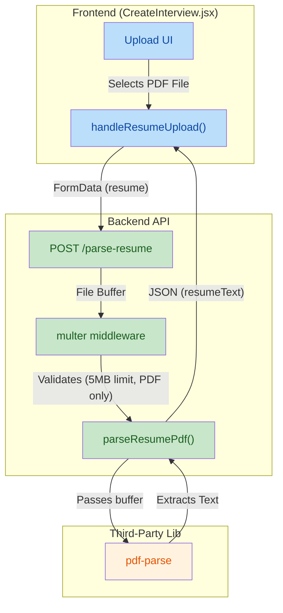
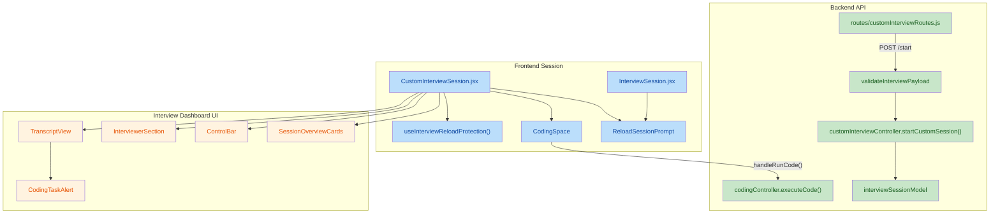
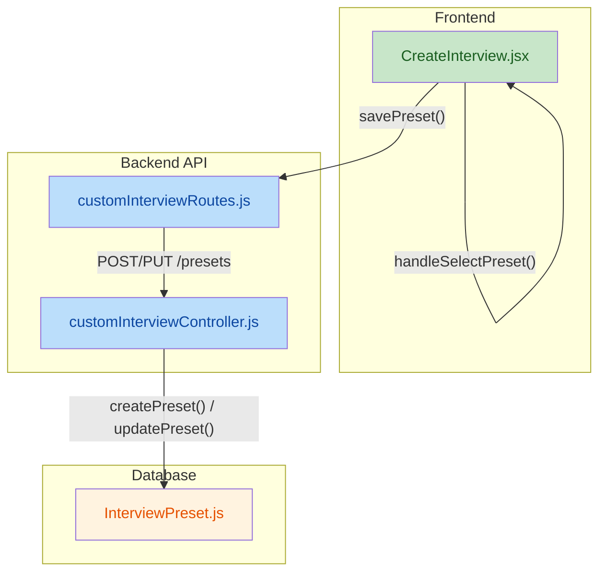
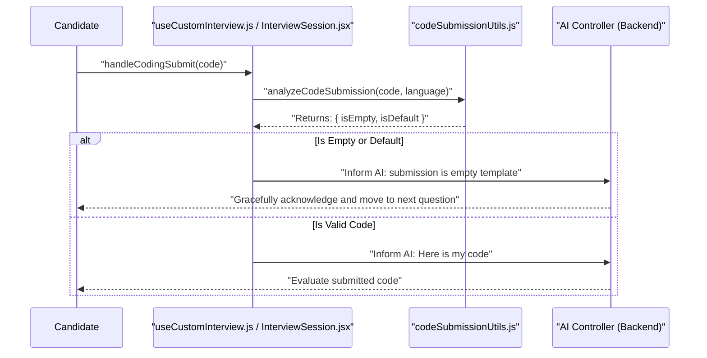
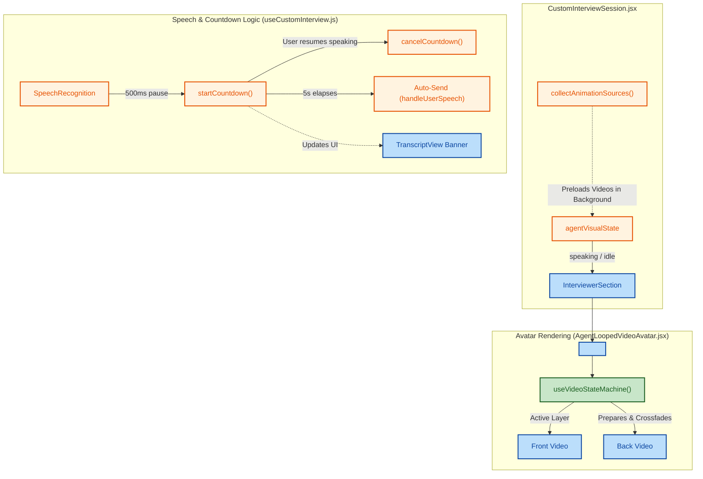
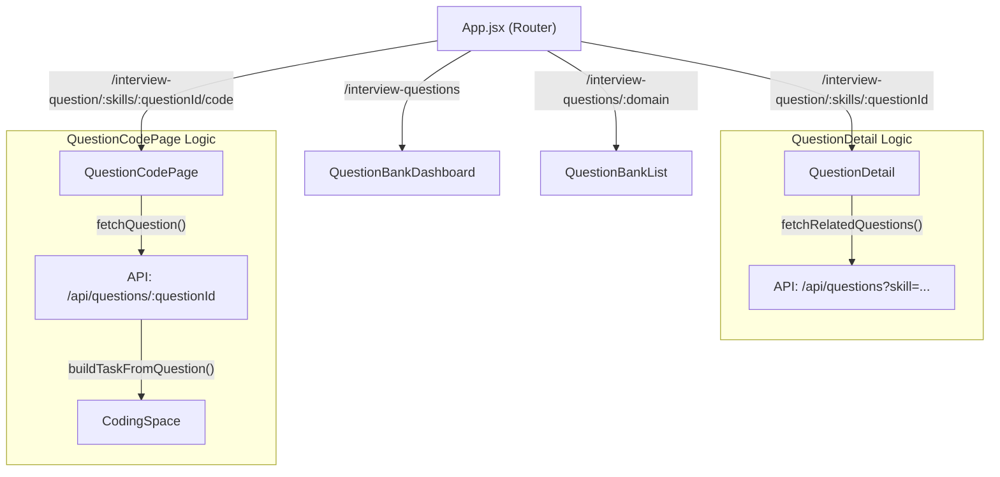
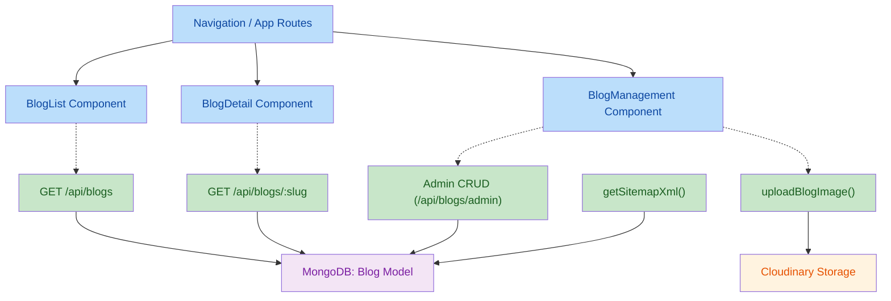
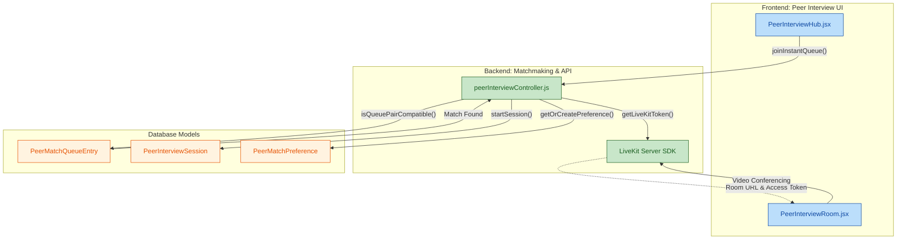

updated on 2026-04-13
## 1. High-Level Summary (TL;DR)
*   **Impact:** Medium - Introduces a new backend API for parsing PDF resumes and enhances the frontend to support file uploads, improving the user experience for interview setup.
*   **Key Changes:**
    *   ✨ **PDF Upload Endpoint:** Added a new backend route (`/parse-resume`) utilizing `multer` and `pdf-parse` to extract text from uploaded resumes.
    *   ✨ **Frontend Integration:** Updated the `CreateInterview` page to allow users to directly upload PDF files instead of relying purely on text input.
    *   🎨 **UI/UX Tweaks:** Improved text contrast across multiple components by updating Tailwind classes (e.g., changing `text-zinc-500` to `text-zinc-400`).
    *   🗑️ **Cleanup:** Removed the "Support & Policy" footer section from the `Billing` page.

## 2. Visual Overview (Code & Logic Map)

The following diagram illustrates the newly introduced PDF upload and parsing flow:



## 3. Detailed Change Analysis

### 📁 Backend: Custom Interview API
*   **What Changed:** Added a new controller and route to handle file uploads securely and extract text content from PDFs.
*   **API Additions:**

| Method | Endpoint | Middleware | Controller | Description |
|---|---|---|---|---|
| `POST` | `/parse-resume` | `userAuth`, `multer` | `parseResumePdf` | Accepts a PDF file (`resume`), checks limits (5MB), and returns the parsed raw text using `pdf-parse`. |

*   **Dependencies:**

| Package | Action | Reason |
|---|---|---|
| `pdf-parse` | Added | Required to extract raw text strings from PDF buffers. |
| `multer` | Added | Required to handle `multipart/form-data` uploads securely in memory. |

### 📁 Frontend: Create Interview Page (`CreateInterview.jsx`)
*   **What Changed:**
    *   Introduced the `handleResumeUpload` method to manage file selection, size validation (< 5MB), and API communication.
    *   Added states `resumeFileName` and `isParsingResume` to handle UI loading states.
    *   Modified the `handleStart` validation logic to ensure users have either uploaded a resume or provided a Job Description before proceeding.
    *   *(Source: `frontend/src/pages/CreateInterview.jsx`)*

### 📁 Frontend: UI Adjustments & Cleanup (`Billing.jsx`, `GroupDiscussionSetup.jsx`)
*   **What Changed:**
    *   **Billing Page:** Removed the "Support & Policy" and "Payment Issues" footer completely to streamline the view.
    *   **Text Contrast:** Changed multiple instances of `text-zinc-500` to `text-zinc-400` in both `CreateInterview` and `GroupDiscussionSetup` components to ensure text is more readable against dark backgrounds.
    *   **Status Indicator:** Changed the active camera/mic pulse indicator color from `bg-emerald-500` to the brand color `bg-[#bef264]`.

## 4. Impact & Risk Assessment
*   ⚠️ **Security Risks:** The introduction of file uploads introduces potential risks. However, this is mitigated by the `multer` configuration which strictly enforces a `5MB` size limit and filters for the `application/pdf` MIME type.
*   **Breaking Changes:** None. The previous text-based input logic appears to gracefully coexist with the new upload flow.
*   🧪 **Testing Suggestions:**
    *   **Upload Validation:** Attempt to upload non-PDF files (e.g., `.docx`, `.png`) to verify the frontend and backend properly reject them.
    *   **Size Constraint:** Attempt to upload a PDF larger than 5MB to ensure the `multer` limit correctly triggers an error response.
    *   **Flow Verification:** Start an interview using the "Both" context source (Resume + Job Description) to ensure the parsed PDF text concatenates correctly with the manual JD input.


## 1. High-Level Summary (TL;DR)
*   **Impact:** High - Introduces major new features including skills-based custom interviews, robust code execution with standard input (stdin) support, interview reload protection, and an extensive UI/UX overhaul of the interview dashboard.
*   **Key Changes:**
    *   ✨ **Skills-Based Interviews:** Added support for selecting skills and specifying `interviewMode` (`roleBased` or `skillsBased`), complete with strict backend payload validation.
    *   ✨ **Terminal Stdin Support:** Added a standard input (`stdin`) text area to the Coding Space terminal, allowing candidates to provide input for code execution.
    *   🛡️ **Interview Reload Protection:** Implemented a new React hook and prompt to prevent accidental session reloads (e.g., hitting F5) and potential data loss during live interviews.
    *   🎨 **UI/UX Overhaul:** Completely redesigned session overview cards, control bars, the interviewer section, and transcript views for better readability and responsive design.

## 2. Visual Overview (Code & Logic Map)



## 3. Detailed Change Analysis

### 🛠️ Interview Creation & Backend Logic
*   **What Changed:** Introduced `interviewMode` (`roleBased` vs `skillsBased`) and tracking for custom/preset skills. Created a robust validation middleware (`validateInterviewPayload.js`) that enforces rules like checking maximum content length (12,000 chars) and ensuring skills are provided if `skillsBased` mode is selected.
*   **Database Schema Changes:** (Source: `interviewSessionModel.js`)

| Field | Type | Default | Description |
|---|---|---|---|
| `userName` | String | `"Candidate"` | Name of the interviewee |
| `interviewMode` | Enum | `"roleBased"` | Mode of interview (`"roleBased"`, `"skillsBased"`) |
| `sourceType` | String | `"resume-job-description"`| Context data source |
| `skills` | `[String]` | `[]` | Array of skill strings for skills-based mode |

*   **API Middleware Updates:** (Source: `customInterviewRoutes.js`)

| Endpoint | Method | Middleware Added | Description |
|---|---|---|---|
| `/start` | POST | `validateInterviewPayload` | Added payload validation before creating the custom session in the DB |

### 💻 Code Execution & Terminal
*   **What Changed:** Upgraded `CodingSpace.jsx` with an `enableTerminalInput` prop. When active, candidates can input standard text (`stdin`) which is packaged and sent to `codingController.js` via the API.
*   **Language Restrictions:** During an active interview, language selection is now disabled, restricting the user to the configured supported languages.

### 🛡️ Interview Reload Protection
*   **What Changed:** Added `useInterviewReloadProtection.js` to intercept window reload events (F5, Ctrl+R, or tab close) during an active interview session.
*   **User Prompt:** Introduced `ReloadSessionPrompt.jsx` to explicitly warn users that reloading will reset their live interview session. 

### 🎨 UI Revamp (Dashboard & Controls)
*   **Session Overview Cards:** (Source: `SessionOverviewCards.jsx`) Completely redesigned from a dark, transparent UI to a solid, high-contrast primary-colored UI layout.
*   **Control Bar:** (Source: `ControlBar.jsx`) Enhanced spacing, padding, responsive behavior (mobile scaling), and added precise hover tooltips.
*   **Interviewer Section:** (Source: `InterviewerSection.jsx`) Added visual overlays indicating connection states ("Connecting Session") and "Interview Tips" while waiting for the transcript to initialize. Included avatar fallbacks for when the user's video is turned off.
*   **Transcript View & Alerts:** (Source: `TranscriptView.jsx`, `CodingTaskAlert.jsx`) Moved the coding popup directly into the transcript view. Added an "Action Disabled" state to prevent users from skipping or attempting challenges while the AI agent is actively speaking.

## 4. Impact & Risk Assessment
*   ⚠️ **Breaking Changes:** 
    *   The new `validateInterviewPayload` middleware introduces strict constraints. Creating an interview with a payload exceeding 12,000 characters or missing required text for a specific `sourceType` will now return a `400 Bad Request`.
*   🐛 **Testing Suggestions:**
    *   **Skills-Based Generation:** Create an interview in "Skills-based" mode, select multiple preset skills, add custom skills, and ensure the prompt correctly populates the database.
    *   **Stdin Execution:** Open a coding task, write a program that requires standard input (e.g., `input()` in Python), provide text in the terminal text area, and click Run.
    *   **Reload Prevention:** Enter a live interview session and attempt to reload the page using F5 or Ctrl+R. Verify that the custom warning prompt appears and prevents the reload until confirmed.
    *   **UI Responsiveness:** Test the `ControlBar` and `SessionOverviewCards` on mobile viewports to verify padding and text truncations.

  Updates on date: 14/04/2026
  ## 1. High-Level Summary (TL;DR)
*   **Impact:** High - Introduces a new feature for saving interview configurations and significantly improves the AI's handling of code submissions and interview flow.
*   **Key Changes:**
    *   **Interview Presets:** Added full CRUD functionality for users to save, manage, and apply interview configuration presets.
    *   **Smart Code Submissions:** Implemented utilities to detect empty or default template code submissions.
    *   **AI Prompt Updates:** Instructed the AI agent to gracefully acknowledge empty/default submissions and move to the next question instead of getting stuck in a loop.
    *   **Session UX Improvements:** Added dedicated confirmation and summary modals for ending interview sessions, plus a typing animation for the AI's transcript.

## 2. Visual Overview (Code & Logic Map)

### Interview Presets Flow


### Smart Code Submission Logic


## 3. Detailed Change Analysis

### 📁 Interview Presets Feature
*   **What Changed:** Users can now save their configured interview settings (Role, Experience, Duration, Skills, etc.) up to a maximum of 30 presets per user. Applying a preset quickly populates the interview setup form.
*   **API Endpoints Added:**
    | Method | Endpoint | Description |
    | :--- | :--- | :--- |
    | `GET` | `/presets` | Lists all saved presets for the authenticated user. |
    | `POST` | `/presets` | Creates a new preset. |
    | `PUT` | `/presets/:presetId` | Updates an existing preset. |
    | `DELETE` | `/presets/:presetId` | Deletes a specific preset. |

### 📁 Smart Code Submission Handling
*   **What Changed:** Created `codeSubmissionUtils.js` which houses logic to strip comments and whitespace to verify if a code submission is effectively empty or just the default language template.
*   **Frontend Integration:** `handleCodingSubmit` in `useCustomInterview.js` and `InterviewSession.jsx` now uses `analyzeCodeSubmission()` to dynamically alter the message sent to the AI agent and the UI toast notification.
*   **Backend Integration:** Updated the system prompts in `customInterviewController.js` and `vapiInterviewController.js`. The AI is now explicitly instructed: *"If the candidate submits code that is empty... DO NOT ask them to provide code again... Immediately proceed to ask the next technical question."*

### 📁 Session UX & Transcript Updates
*   **What Changed:**
    *   Replaced the inline "Interview Finished" overlay in `InterviewerSection.jsx` with two new dedicated components: `CustomInterviewConfirmEndModal.jsx` and `CustomInterviewEndedModal.jsx`.
    *   Added a character-by-char typing animation (`typedAgentText`) in `TranscriptView.jsx` to make the AI agent's responses feel more natural.

### 📁 Database Schema
*   **New Model:**
    | Field | Type | Default | Description |
    | :--- | :--- | :--- | :--- |
    | `userId` | `ObjectId` | *Required* | Reference to the User. |
    | `name` | `String` | *Required* | Name of the preset. |
    | `interviewMode` | `String` | `"roleBased"` | Either `"roleBased"` or `"skillsBased"`. |
    | `skills` | `[String]` | `[]` | Array of extracted/selected skills. |
    | `duration` | `Number` | `10` | Interview duration (5-120 mins). |

## 4. Impact & Risk Assessment
*   **⚠️ Breaking Changes:** Requires MongoDB schema updates. Ensure the new `InterviewPreset` collection can be created successfully.
*   **🐛 Potential Risks:** The typing animation in `TranscriptView.jsx` uses `setInterval` tied to React state. If the user receives rapidly successive AI messages, the timer cleanup logic must perfectly execute to prevent text overlapping or memory leaks.
*   **🧪 Testing Suggestions:**
    *   **Presets:** Test creating a preset with a duplicate name (should handle HTTP 409 correctly). Test the slider scrolling UI for presets on smaller screens.
    *   **Code Submissions:** Test submitting a blank screen, a screen with only comments (`// this is a comment`), the exact default template, and a legitimate code answer. Verify the AI agent's vocal response correctly matches the prompt instructions for each scenario.
    *   **Session Flow:** Click the "End Interview" button and ensure the new confirmation modal correctly halts the ending process if "Cancel" is clicked.

 Date : 16/4/26
## 1. High-Level Summary (TL;DR)
*   **Impact:** High - Significantly enhances the interview experience with seamless video avatars and improved speech-to-text (STT) pacing.
*   **Key Changes:**
    *   ✨ **Looped Video Avatars:** Introduced `AgentLoopedVideoAvatar` to handle smooth crossfading between agent animation states (idle, speaking).
    *   ⏱️ **STT Auto-Send Countdown:** Added a 5-second countdown before auto-sending user speech, allowing users to pause and think without prematurely submitting their answer.
    *   🚀 **Intelligent Preloading:** Implemented dynamic video preloading in the session to ensure zero-delay playback when the agent's state changes.
    *   🎨 **Agent Data Overhaul:** Updated agent configurations to support multiple random video clips per state and dedicated profile thumbnails.
    *   ♻️ **UI Refactoring:** Cleaned up `InterviewerSection` and enhanced `TranscriptView` with live status banners for the countdown and speaker turns.

## 2. Visual Overview (Code & Logic Map)



## 3. Detailed Change Analysis

### 🎥 Video Avatar System
*   **Component Name:** `AgentLoopedVideoAvatar`, `InterviewerSection`
*   **What Changed:** Replaced inline video crossfading in `InterviewerSection` with a dedicated `AgentLoopedVideoAvatar` component. It uses a custom hook (`useVideoStateMachine`) to manage double-buffered `<video>` elements, allowing seamless transitions and randomized clip selection for the same state. Added intelligent video caching via hidden `<video>` elements in `CustomInterviewSession` based on the agent's current state.

### ⏱️ Speech-to-Text Countdown
*   **Component Name:** `useCustomInterview`, `TranscriptView`
*   **What Changed:** Changed the STT submission logic to prevent cutting off users. After a 500ms pause (`PAUSE_DETECT`), a 5-second countdown begins. If the user resumes speaking, the countdown cancels. If it reaches 0, the answer is auto-submitted. `TranscriptView` was updated to display dynamic banners (e.g., Amber countdown, Sky Blue agent speaking, Emerald listening).

### ⚙️ Agent Configurations
*   **Component Name:** `agents.js`, `CreateInterview`, `PastInterviews`
*   **What Changed:** Updated agent profiles to support arrays of animation paths (enabling random clip rotation). Temporarily disabled several agents that lack animations. Updated the UI to use the new `profileImage` attribute for thumbnails instead of the main fallback image.

| Property | Old Type | New Type | Description |
|---|---|---|---|
| `animations.idle` | `String` | `Array<String>` | Supports multiple idle clips, chosen randomly. |
| `animations.speaking` | `String` | `Array<String>` | Supports multiple speaking clips, chosen randomly. |
| `profileImage` | *None* | `String` | Added dedicated thumbnail paths for UI selection grids. |
| `image` | `String` | `String` | Updated fallback image paths to new assets. |

### 🏠 Homepage Features
*   **Component Name:** `Features.jsx`
*   **What Changed:** Updated `videoSrc` paths for the homepage feature highlights (`interview.mp4` and `feedback.mp4`).

## 4. Impact & Risk Assessment
*   **⚠️ Breaking Changes:** Several agents (Elliot, Rachel, Drew, Clyde, Mimi, Fin, Nicole) have been commented out in `agents.js` as they do not yet support the new animation structure.
*   **🐛 Testing Suggestions:**
    *   **Avatar Transitions:** Verify that the agent smoothly crossfades between idle and speaking states without flickering or black frames.
    *   **STT Pacing & Countdown:** Speak into the microphone, pause for 1 second to trigger the amber countdown banner, then speak again to verify it cancels. Let the countdown finish to ensure the message auto-sends.
    *   **Performance:** Monitor the network tab to ensure video preloading (`collectAnimationSources`) does not cause excessive bandwidth usage or memory leaks over long sessions.
    *   **UI Fallbacks:** Disconnect the internet momentarily to ensure the agent falls back to the static `image` gracefully if a video fails to load.

    Date : 19/4/2025
    ## 1. High-Level Summary (TL;DR)
*   **Impact:** Medium
*   **Key Changes:**
    *   **SEO-Friendly Routing:** Refactored Question Bank URLs (e.g., from `/questions/:id` to `/interview-question/:skills/:questionId`) for better SEO and context.
    *   **New Coding Interface:** Introduced `QuestionCodePage` to render interactive coding challenges based on fetched question data.
    *   **Enhanced Error Handling:** Centralized API error parsing and toast notification logic in `CreateInterview` and `GroupDiscussionSetup`.
    *   **Related Questions:** Added functionality to fetch and display related questions dynamically on the `QuestionDetail` page.
    *   **Robust Local Storage:** Replaced inline `localStorage` checks with a safer `getStoredBoolean` utility in `InterviewContext`.

## 2. Visual Overview (Code & Logic Map)



## 3. Detailed Change Analysis

### 🗺️ Routing & Navigation
*   **What Changed:** Redesigned the Question Bank URL structure to be more descriptive and parameter-driven. Updated `Sidebar.jsx` and `layout.jsx` to keep the active state synchronized with the new URL structures.

| Old Route | New Route | Component | Reason |
| :--- | :--- | :--- | :--- |
| `/questions` | `/interview-questions` | `QuestionBankDashboard` | Improved SEO & clarity |
| `/questions/list` | `/interview-questions/:domain` | `QuestionBankList` | Domain-based filtering |
| `/questions/:id` | `/interview-question/:skills/:questionId` | `QuestionDetail` | Inject skills context |
| `/code` | `/code-space`, `/interview-question/.../code` | `QuestionCodePage` | Dedicated coding space |

### 📚 Question Bank Enhancements
*   **What Changed:** 
    *   **`QuestionDetail.jsx`:** Replaced the `id` param with `skills` and `questionId`. Implemented a new `useEffect` hook to fetch related questions dynamically based on the current question's primary skill, domain, or company. Added `slugifySkill` utility for URL construction.
    *   **`QuestionBankList.jsx`:** Replaced query parameter domain filtering with a route parameter (`useParams().domain`). Includes automatic redirection logic to clean up legacy `domain` query parameters.

### 🐛 Error Handling & State Management
*   **What Changed:** 
    *   **`CreateInterview.jsx` & `GroupDiscussionSetup.jsx`:** Introduced `getDetailedErrorMessage`, `showErrorToast`, and `clearFieldError` helpers. This provides detailed, backend-provided error feedback to the user instead of generic messages.
    *   **`GroupDiscussionSetup.jsx`:** Added explicit validation to prevent starting a session if the microphone (`micReady`) is unavailable.
    *   **`InterviewContext.jsx`:** Created `getStoredBoolean` helper to safely parse boolean flags from `localStorage`, preventing application crashes on invalid JSON payloads.

### 💻 New Component: QuestionCodePage
*   **What Changed:** Added `QuestionCodePage.jsx` which bridges the question data from the backend to the `CodingSpace` component. It includes a `buildTaskFromQuestion` adapter function that normalizes the API payload (extracting `starterCode`, `testCases`, and `constraints`) into a `task` object readable by the IDE component.

## 4. Impact & Risk Assessment
*   **⚠️ Breaking Changes:** 
    *   **Bookmarks:** Users with bookmarked `/questions/:id` URLs will encounter 404s unless a server-side or router-level redirect is implemented.
*   **🔍 Testing Suggestions:**
    *   Verify navigation flow from the Dashboard -> List -> Detail -> Code Page to ensure parameters (`skills`, `domain`, `questionId`) propagate correctly.
    *   Test edge cases in `CreateInterview` and `GroupDiscussionSetup` by denying microphone/camera permissions to ensure the new error handlers trigger properly.
    *   Load a question with missing `starterCode` or `testCases` in `QuestionCodePage` to ensure the `buildTaskFromQuestion` fallbacks work without crashing.


    ## 1. High-Level Summary (TL;DR)
*   **Impact:** High - Introduces a major new feature to the platform.
*   **Key Changes:**
    *   ✨ **Full-Stack Blog Module:** Adds a MongoDB schema, robust backend CRUD APIs, and frontend views (`BlogList`, `BlogDetail`) for a complete blogging experience.
    *   🛠 **Admin Content Management:** Introduces a dedicated `BlogManagement` interface for administrators to create, edit, draft, and publish articles.
    *   🖼 **Cloudinary Integration:** Supports uploading and hosting blog featured images via `multer` and the Cloudinary API.
    *   🔍 **SEO Enhancements:** Adds a dynamically generated `/sitemap.xml`, a static `robots.txt`, and dynamic OpenGraph tags using `react-helmet-async`.
    *   📝 **Markdown Rendering:** Renders blog content securely on the frontend using `react-markdown` and `remark-gfm`.

## 2. Visual Overview (Code & Logic Map)



## 3. Detailed Change Analysis

### 🗄 Backend API & Database
*   **What Changed:** Added a complete API layer for the blog feature. Created the `Blog` Mongoose model containing fields for SEO, Markdown content, status (draft/published), and tags. Implemented `blogController.js` handling operations like unique slug generation (`ensureUniqueSlug`), HTML sanitization (`sanitizeMarkdown`), read-time calculation (`calculateReadTime`), and XML sitemap generation (`getSitemapXml`).
*   **API Endpoints:**

| API Endpoint | Method | Auth Required | Description |
|---|---|---|---|
| `/api/blogs` | GET | No | Fetch paginated list of published blogs. |
| `/api/blogs/:slug` | GET | No | Fetch a single published blog by slug. |
| `/api/blogs/admin/all` | GET | Yes (Admin) | Fetch all blogs (drafts & published). |
| `/api/blogs/admin` | POST | Yes (Admin) | Create a new blog post. |
| `/api/blogs/admin/:id` | PUT/DEL | Yes (Admin) | Update or soft-delete a blog. |
| `/api/blogs/admin/upload-image` | POST | Yes (Admin) | Upload an image to Cloudinary via `multer`. |
| `/sitemap.xml` | GET | No | Generates an XML sitemap of all published blogs. |

### 🌐 External Integrations & Configuration
*   **What Changed:** Added Cloudinary integration for handling featured images. The `cloudinaryService.js` exposes `uploadImageBuffer` which converts a `multer` memory buffer to a base64 Data URI and uploads it to the `interviewmate/blogs` folder. Added necessary `.env` variables.
*   **Environment Configuration:**

| Key | Old Value | New Value | Description |
|---|---|---|---|
| `CLOUDINARY_CLOUD_NAME` | *N/A* | *(New)* | Cloudinary account name for image hosting. |
| `CLOUDINARY_API_KEY` | *N/A* | *(New)* | Cloudinary API Key. |
| `CLOUDINARY_API_SECRET` | *N/A* | *(New)* | Cloudinary API Secret. |

*   **Dependencies:**

| Package | Old Ver | New Ver | Purpose |
|---|---|---|---|
| `cloudinary` | *N/A* | `^2.9.0` | Backend image upload handler. |
| `remark-gfm` | *N/A* | `^4.0.1` | Frontend markdown rendering (GitHub Flavored). |

### 🖥 Frontend Application
*   **What Changed:** 
    *   Created `BlogList.jsx` for displaying a paginated grid of articles.
    *   Created `BlogDetail.jsx` for rendering the full article using `react-markdown`. 
    *   Created `BlogManagement.jsx` to provide an interface for admins to manage content. 
    *   Updated `App.jsx` to register the new routes (`/blog`, `/blog/:slug`, `/admin/blogs`) and `layout.jsx` to add the navigation links.
    *   **SEO Updates:** Added `robots.txt` and dynamically updated `meta` and `canonicalUrl` tags using `react-helmet-async` on the blog pages to improve search engine visibility.

## 4. Impact & Risk Assessment
*   **Breaking Changes:** None. This is a purely additive feature.
*   **Testing Suggestions:**
    *   **Image Uploads:** Verify Cloudinary image uploads from the Admin panel to ensure the correct environment variables are loaded and the image buffer is processed correctly.
    *   **Slug Generation:** Test the `ensureUniqueSlug` logic by creating multiple blogs with the exact same title to ensure suffixes (`-1`, `-2`) are appended.
    *   **SEO Validation:** Validate the generated `/sitemap.xml` endpoint to ensure it correctly maps to valid URLs and excludes drafts.
    *   **Markdown Rendering:** Test rendering complex markdown (tables, code blocks) in `BlogDetail` to ensure `remark-gfm` parses it correctly without breaking the UI layout.

    Date: 20/4/2026

    ## 1. High-Level Summary (TL;DR)
*   **Impact:** High - Introduces a complete Peer-to-Peer Video Interview feature with real-time matchmaking and video conferencing.
*   **Key Changes:**
    *   ✨ **Matchmaking System:** Built an instant queue and direct invite system for peer interviews.
    *   📹 **Video Conferencing:** Integrated **LiveKit** SDKs on both frontend and backend for real-time video/audio rooms.
    *   🛡️ **Trust & Safety:** Added user moderation tools including blocking and reporting mechanisms.
    *   🗄️ **Data Models:** Created 6 new MongoDB collections to track preferences, sessions, requests, and queues.
    *   🔧 **Query Refactoring:** Migrated existing `findOneAndUpdate` queries to use `{ returnDocument: "after" }` instead of `{ new: true }`.

## 2. Visual Overview (Code & Logic Map)



## 3. Detailed Change Analysis

### 🎯 Peer Interview Matchmaking (Backend)
*   **What Changed:** Added a robust matchmaking engine in `peerInterviewController.js`. It allows users to either send direct requests or join an instant queue. The `isQueuePairCompatible()` function evaluates potential matches based on gender preferences, skill overlap (`hasSkillOverlap()`), and preferred language.
*   **Source:** `backend/controllers/peerInterviewController.js`, `backend/models/PeerMatchQueueEntry.js`

### 📹 Video Conferencing Integration (Full-Stack)
*   **What Changed:** Integrated LiveKit for handling WebRTC video calls. The backend generates secure access tokens using `livekit-server-sdk`, while the frontend uses `@livekit/components-react` inside `PeerInterviewRoom.jsx` to render the actual video layout and manage local/remote streams.
*   **Source:** `frontend/src/pages/PeerInterview/PeerInterviewRoom.jsx`, `backend/routes/peerInterviewRoutes.js`

### 🛡️ User Moderation & Safety
*   **What Changed:** Implemented mechanisms to prevent abuse during peer interactions. Users can report others (`PeerUserReport.js`) or block them (`PeerUserBlock.js`). The matching logic explicitly checks `areUsersBlocked()` before connecting two users.

### 🗄️ New API Endpoints
| Endpoint | Method | Description |
|---|---|---|
| `/api/peer-interview/preferences` | GET / POST | Fetch or update user matching preferences |
| `/api/peer-interview/request` | POST | Send a direct peer interview request |
| `/api/peer-interview/queue/join` | POST | Join the instant matchmaking queue |
| `/api/peer-interview/session/:sessionId/token` | POST | Generate a LiveKit access token |
| `/api/peer-interview/report` | POST | Report a user for misconduct |

### 📦 Dependency Updates
| Package | Type | Version |
|---|---|---|
| `livekit-server-sdk` | Backend | `^2.15.1` |
| `@livekit/components-react` | Frontend | `^2.9.20` |
| `@livekit/components-styles` | Frontend | `^1.2.0` |
| `livekit-client` | Frontend | `^2.18.3` |

### ⚙️ Environment Configuration
| Key | Old Value | New Value | Description |
|---|---|---|---|
| `LIVEKIT_URL` | *None* | `wss://your-livekit-host` | WebSocket URL for the LiveKit server |
| `LIVEKIT_API_KEY` | *None* | `devkey` | Authentication key for LiveKit |
| `LIVEKIT_API_SECRET` | *None* | `secret` | Secret key for generating tokens |
| `LIVEKIT_TOKEN_TTL` | *None* | `10m` | Token expiration time |

### 🔍 Code Snippet: Matchmaking Logic
```javascript
const isQueuePairCompatible = ({ mePreference, peerPreference, meQueue, peerQueue }) => {
  if (!mePreference.allowInstantMatch || !peerPreference.allowInstantMatch) return false;
  
  // Strict gender preference evaluation
  if (!isGenderAllowed(mePreference, peerGender)) return false;
  if (!isGenderAllowed(peerPreference, meGender)) return false;

  // Language and Skill overlap validation
  if (meQueue.preferredLanguage !== peerQueue.preferredLanguage) return false;
  if (!hasSkillOverlap(meQueue.targetSkills || [], peerQueue.targetSkills || [])) return false;

  return true;
};
```

## 4. Impact & Risk Assessment
*   ⚠️ **Breaking Changes:** No explicit API breakages, but refactoring MongoDB updates from `{ new: true }` to `{ returnDocument: "after" }` in `vapiKeyManager.js` and `customInterviewController.js` alters native MongoDB driver behavior vs Mongoose legacy behavior. Ensure this doesn't conflict with existing Mongoose middleware.
*   🧪 **Testing Suggestions:**
    *   **Matchmaking Edge Cases:** Verify that the instant queue correctly isolates users when strict `female_only` or `male_only` gender preferences are applied.
    *   **Room Teardown:** Test `leaveQueueSafely()` and browser close events in `PeerInterviewRoom.jsx` to ensure ghost sessions are properly cleaned up on LiveKit and the database.
    *   **Blocklist Integrity:** Attempt to match two users who have an active `PeerUserBlock` record to guarantee the system blocks the interaction.