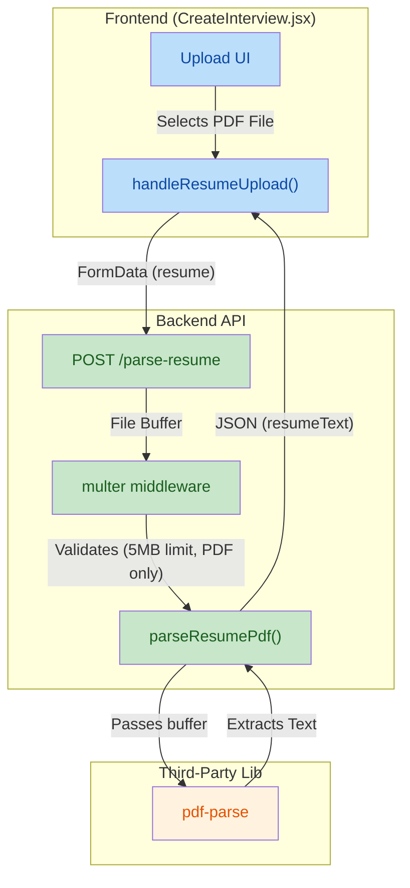

updated on 2026-04-13
## 1. High-Level Summary (TL;DR)
*   **Impact:** Medium - Introduces a new backend API for parsing PDF resumes and enhances the frontend to support file uploads, improving the user experience for interview setup.
*   **Key Changes:**
    *   ✨ **PDF Upload Endpoint:** Added a new backend route (`/parse-resume`) utilizing `multer` and `pdf-parse` to extract text from uploaded resumes.
    *   ✨ **Frontend Integration:** Updated the `CreateInterview` page to allow users to directly upload PDF files instead of relying purely on text input.
    *   🎨 **UI/UX Tweaks:** Improved text contrast across multiple components by updating Tailwind classes (e.g., changing `text-zinc-500` to `text-zinc-400`).
    *   🗑️ **Cleanup:** Removed the "Support & Policy" footer section from the `Billing` page.

## 2. Visual Overview (Code & Logic Map)

The following diagram illustrates the newly introduced PDF upload and parsing flow:

## 3. Detailed Change Analysis

### 📁 Backend: Custom Interview API
*   **What Changed:** Added a new controller and route to handle file uploads securely and extract text content from PDFs.
*   **API Additions:**

| Method | Endpoint | Middleware | Controller | Description |
|---|---|---|---|---|
| `POST` | `/parse-resume` | `userAuth`, `multer` | `parseResumePdf` | Accepts a PDF file (`resume`), checks limits (5MB), and returns the parsed raw text using `pdf-parse`. |

*   **Dependencies:**

| Package | Action | Reason |
|---|---|---|
| `pdf-parse` | Added | Required to extract raw text strings from PDF buffers. |
| `multer` | Added | Required to handle `multipart/form-data` uploads securely in memory. |

### 📁 Frontend: Create Interview Page (`CreateInterview.jsx`)
*   **What Changed:**
    *   Introduced the `handleResumeUpload` method to manage file selection, size validation (< 5MB), and API communication.
    *   Added states `resumeFileName` and `isParsingResume` to handle UI loading states.
    *   Modified the `handleStart` validation logic to ensure users have either uploaded a resume or provided a Job Description before proceeding.
    *   *(Source: `frontend/src/pages/CreateInterview.jsx`)*

### 📁 Frontend: UI Adjustments & Cleanup (`Billing.jsx`, `GroupDiscussionSetup.jsx`)
*   **What Changed:**
    *   **Billing Page:** Removed the "Support & Policy" and "Payment Issues" footer completely to streamline the view.
    *   **Text Contrast:** Changed multiple instances of `text-zinc-500` to `text-zinc-400` in both `CreateInterview` and `GroupDiscussionSetup` components to ensure text is more readable against dark backgrounds.
    *   **Status Indicator:** Changed the active camera/mic pulse indicator color from `bg-emerald-500` to the brand color `bg-[#bef264]`.

## 4. Impact & Risk Assessment
*   ⚠️ **Security Risks:** The introduction of file uploads introduces potential risks. However, this is mitigated by the `multer` configuration which strictly enforces a `5MB` size limit and filters for the `application/pdf` MIME type.
*   **Breaking Changes:** None. The previous text-based input logic appears to gracefully coexist with the new upload flow.
*   🧪 **Testing Suggestions:**
    *   **Upload Validation:** Attempt to upload non-PDF files (e.g., `.docx`, `.png`) to verify the frontend and backend properly reject them.
    *   **Size Constraint:** Attempt to upload a PDF larger than 5MB to ensure the `multer` limit correctly triggers an error response.
    *   **Flow Verification:** Start an interview using the "Both" context source (Resume + Job Description) to ensure the parsed PDF text concatenates correctly with the manual JD input.