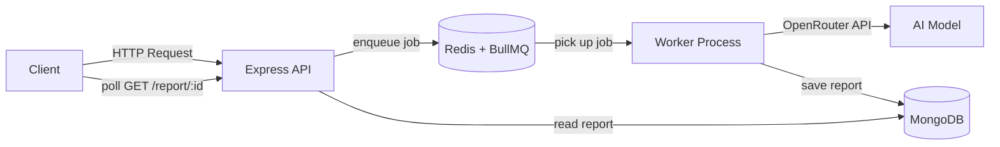
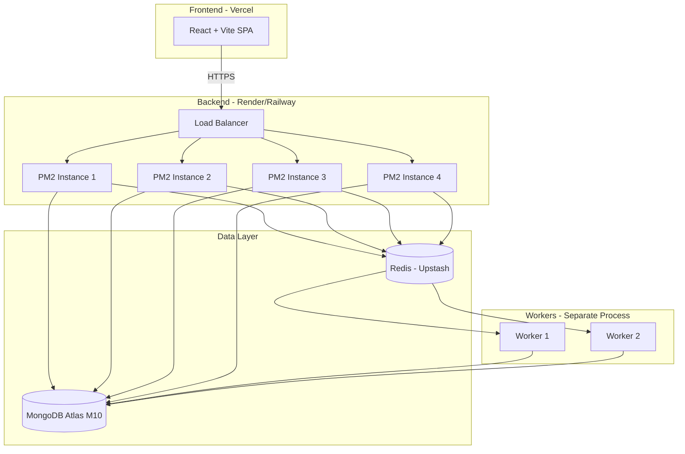

# 🔍 PlaceMateAI — Comprehensive Platform Audit & Scaling Plan

> **Goal**: Identify every issue across the platform (AI, backend, security, scalability), categorize them by severity, and provide a production-ready scaling plan with BullMQ queue implementation for 10,000+ users.
> 
> **Note**: VAPI interview system is excluded — only the **Custom AI Interview** system is in use.

---

## Table of Contents
1. [🔴 CRITICAL Issues](#-critical-issues)
2. [🟡 MODERATE Issues](#-moderate-issues)
3. [🟢 NORMAL Issues](#-normal-issues)
4. [🏗️ BullMQ Queue Implementation Plan](#️-bullmq-queue-implementation-plan)
5. [📈 Scaling Architecture for 10K+ Users](#-scaling-architecture-for-10k-users)
6. [✅ Execution Checklist](#-execution-checklist)

---

## 🔴 CRITICAL Issues

> [!CAUTION]
> These issues will cause crashes, data loss, security breaches, or financial loss in production. Fix ALL of them before launch.

---

### C1. 🔓 API Keys Exposed in `.env` (Potentially Committed to Git)

**File**: [.env](file:///d:/interviewMate/backend/.env)

**Problem**: The `.env` file contains live API keys for **Clerk, VAPI, OpenRouter, and Razorpay** — and the `.gitignore` only contains `node_modules`. If this repo has ever been pushed to GitHub (even private), these keys are compromised.

**Exposed keys include**:
- Clerk Secret Key (`sk_test_...`)
- OpenRouter API Key (`sk-or-v1-...`)
- Razorpay Key ID + Secret
- Razorpay Webhook Secret
- Clerk Webhook Secret

**Fix**:
1. Add `.env` to `.gitignore` immediately
2. Rotate ALL exposed keys from their respective dashboards
3. Use environment variable injection from hosting platform (Render/Railway/Vercel)
4. Create a `.env.example` with placeholder values

```diff
# .gitignore
 node_modules
+.env
+.env.local
+.env.production
```

---

### C2. 🌐 CORS Wide Open — Any Origin Can Call Your API

**File**: [index.js](file:///d:/interviewMate/backend/index.js#L30)

**Problem**: `app.use(cors())` with no options allows **ANY website** to call your API. An attacker can build a phishing site that makes authenticated requests to your backend using your users' tokens.

**Fix**:
```diff
-app.use(cors());
+app.use(cors({
+  origin: [
+    'https://placemateai.com',
+    'https://www.placemateai.com',
+    process.env.NODE_ENV === 'development' && 'http://localhost:5173',
+  ].filter(Boolean),
+  credentials: true,
+  methods: ['GET', 'POST', 'PUT', 'DELETE', 'PATCH'],
+}));
```

---

### C3. 🚨 Code Execution Endpoint Has ZERO Authentication

**File**: [codingRoutes.js](file:///d:/interviewMate/backend/routes/codingRoutes.js#L5)

**Problem**: `POST /api/coding/execute` has **no auth middleware** and **no rate limiting**. Anyone on the internet can execute arbitrary code on JDoodle using your API credentials. This is an immediate abuse vector — bots will drain your JDoodle quota in minutes.

**Fix**:
```diff
 const express = require('express');
 const router = express.Router();
 const codingController = require('../controllers/codingController');
+const { clerkAuth } = require('../middleware/auth');
+const rateLimit = require('express-rate-limit');

+const codeExecLimit = rateLimit({
+  windowMs: 60 * 1000,
+  max: 10, // max 10 executions per minute per user
+  keyGenerator: (req) => req.user?._id?.toString() || req.ip,
+});

-router.post('/execute', codingController.executeCode);
+router.post('/execute', clerkAuth, codeExecLimit, codingController.executeCode);
```

---

### C4. 💰 Race Condition in Credit Deduction (Double-Spend)

**Files**: [creditService.js](file:///d:/interviewMate/backend/services/creditService.js#L14-L46), [customInterviewController.js](file:///d:/interviewMate/backend/controllers/customInterviewController.js#L43-L51)

**Problem**: The credit deduction flow is:
1. Read subscription credits from DB
2. Check if credits >= amount
3. Subtract and save

This is a classic **read-then-write race condition**. If a user opens two browser tabs and clicks "Start Interview" simultaneously, both requests read the same credit balance, both pass the check, and both deduct — resulting in **negative credits** or **double service for single payment**.

**Fix**: Use MongoDB atomic operations:
```javascript
// In creditService.js — replace the read-check-write with atomic update
deduct: async (userId, service, duration = 0) => {
  const user = await User.findById(userId).populate("subscription");
  if (!user || !user.subscription) return { success: false };

  const sub = user.subscription;
  if (sub.tier === "Infinite Elite" && service !== "tools") {
    return { success: true, credits: sub.credits };
  }

  const amount = service === "mock_interview" ? 10 
               : service === "gd_session" ? 8 
               : 5;

  // Atomic: only deducts if credits >= amount
  const result = await Subscription.findOneAndUpdate(
    { _id: sub._id, credits: { $gte: amount } },
    { $inc: { credits: -amount } },
    { new: true }
  );

  if (!result) {
    return { success: false, message: "Insufficient credits", needed: amount, available: sub.credits };
  }

  return { success: true, amount, remaining: result.credits };
}
```

---

### C5. 💥 `referralController` Uses Legacy `credits.interviews` Object Format

**File**: [referralController.js](file:///d:/interviewMate/backend/controllers/referralController.js#L70-L75)

**Problem**: `processReferral` and `rewardReferrer` still use the OLD credits schema (`subscription.credits.interviews += 1`) but the current Subscription model uses a **flat Number** (`credits: Number`). This will silently fail or corrupt data whenever a referral is processed.

```javascript
// Line 72-73: refereeSubscription.credits.interviews += 1;
//             refereeSubscription.credits.gdSessions += 1;
// ← 'credits' is a Number, not an Object. Adding properties to a Number is a silent no-op.
```

**Fix**:
```diff
 // processReferral — reward the referee
 const refereeSubscription = await Subscription.findOne({ user: newUserId });
 if (refereeSubscription) {
-  refereeSubscription.credits.interviews += 1;
-  refereeSubscription.credits.gdSessions += 1;
+  refereeSubscription.credits += 18; // 10 (1 interview) + 8 (1 GD session)
   await refereeSubscription.save();
 }

 // rewardReferrer — reward the referrer
 const referrerSubscription = await Subscription.findOne({ user: referral.referrer });
 if (referrerSubscription) {
-  referrerSubscription.credits.interviews += 1;
-  referrerSubscription.credits.gdSessions += 1;
+  referrerSubscription.credits += 18;
   await referrerSubscription.save();
 }
```

---

### C6. 🔥 No Rate Limiting on AI-Heavy Endpoints

**Files**: All AI route files except subscription routes

**Problem**: The following endpoints make expensive OpenRouter/OpenAI API calls with **ZERO rate limiting**:
- `POST /api/custom-interview/chat` — LLM call per request (called rapidly during interview)
- `POST /api/group-discussion/next-turn` — LLM call per request
- `POST /api/group-discussion/opening` — LLM call per request
- `POST /api/linkedin/analyze` — LLM call per request
- `POST /api/linkedin/generate-headlines` — LLM call per request
- `POST /api/ats/score` — LLM call per request

A single user rapidly clicking or a bot can burn through your entire OpenRouter budget in minutes.

**Fix**: Create a centralized rate limiter middleware:
```javascript
// backend/middleware/rateLimiters.js
const rateLimit = require('express-rate-limit');

// For chat-style endpoints (called frequently during interviews)
const chatRateLimit = rateLimit({
  windowMs: 60 * 1000,
  max: 30,             // 30 chat messages per minute per user
  keyGenerator: (req) => req.user?._id?.toString() || req.ip,
  message: { message: 'Too many requests. Please slow down.' },
});

// For one-shot AI operations (ATS, LinkedIn, report generation)
const aiToolRateLimit = rateLimit({
  windowMs: 60 * 1000,
  max: 10,
  keyGenerator: (req) => req.user?._id?.toString() || req.ip,
  message: { message: 'AI rate limit reached. Please wait a moment.' },
});

module.exports = { chatRateLimit, aiToolRateLimit };
```

---

### C7. 🔥 Background Async Analysis Has No Safety Net

**Files**: [gdController.js](file:///d:/interviewMate/backend/controllers/gdController.js#L396-L421)

**Problem**: The `generateGDReport` function fires off analysis in an untracked `(async () => { ... })()` block. Problems with this:
1. **No retry** — if OpenRouter is temporarily down, the analysis fails permanently
2. **No monitoring** — you have no visibility into how many analyses are running, queued, or failed
3. **Memory leak risk** — 1000 concurrent analyses = 1000 untracked async closures holding transcript data in memory
4. **Server restart = lost jobs** — any in-flight analysis is silently lost on deploy/restart
5. **No concurrency control** — 500 users ending GDs at once = 500 simultaneous OpenRouter calls = instant rate limit

**Fix**: This is the primary candidate for **BullMQ queues** (see Section 4).

---

### C8. 🔑 Missing JDoodle API Credentials

**File**: [codingController.js](file:///d:/interviewMate/backend/controllers/codingController.js#L25-L26)

**Problem**: `JDOODLE_CLIENT_ID` and `JDOODLE_CLIENT_SECRET` are referenced in the code but **not present in `.env`**. The code execution feature will always fail with a 401 from JDoodle API.

**Fix**: Add to `.env`:
```
JDOODLE_CLIENT_ID=your_client_id_here
JDOODLE_CLIENT_SECRET=your_client_secret_here
```

---

### C9. 📊 Missing Database Indexes — Slow Queries at Scale

**Files**: All model files

**Problem**: Critical query patterns have **no indexes**:
- `InterviewSession.find({ userId })` — no index on `userId`
- `GDSession.find({ userId })` — no index on `userId`
- `Question.find({ skills: ... })` — no index on `skills`
- `Question.find({ companies: ... })` — no index on `companies`
- `Order.findOne({ razorpayOrderId })` — no index on `razorpayOrderId`
- `Order.findOne({ idempotencyKey })` — no index on `idempotencyKey`
- `Subscription.findOne({ user })` — no index on `user` beyond the `unique: true`

At 10,000 users, these will cause **full collection scans** resulting in 5-10 second query times.

**Fix**: Add compound indexes to models:
```javascript
// InterviewSession model
interviewSessionSchema.index({ userId: 1, createdAt: -1 });
interviewSessionSchema.index({ status: 1 });

// GDSession model
gdSessionSchema.index({ userId: 1, createdAt: -1 });
gdSessionSchema.index({ status: 1 });

// Question model
questionSchema.index({ skills: 1 });
questionSchema.index({ companies: 1 });
questionSchema.index({ domains: 1 });
questionSchema.index({ isActive: 1, createdAt: -1 });
questionSchema.index({ title: 'text' }); // Text index for search

// Order model — add to Order.js
orderSchema.index({ razorpayOrderId: 1 }, { unique: true });
orderSchema.index({ idempotencyKey: 1 }, { unique: true, sparse: true });
orderSchema.index({ user: 1, createdAt: -1 });
```

---

### C10. 📦 50MB Request Body Limit — DoS Vector

**File**: [index.js](file:///d:/interviewMate/backend/index.js#L31-L32)

**Problem**: `express.json({ limit: '50mb' })` allows anyone to send a 50MB JSON payload to any endpoint, consuming server memory. 200 concurrent 50MB requests = 10GB RAM consumed = server crashes instantly.

**Fix**: Use reasonable defaults with route-specific overrides:
```diff
-app.use(express.json({ limit: '50mb' }));
-app.use(express.urlencoded({ limit: '50mb', extended: true }));
+app.use(express.json({ limit: '1mb' }));   // Default: 1MB is generous
+app.use(express.urlencoded({ limit: '1mb', extended: true }));
```
For routes that genuinely need bigger payloads (bulk question upload), apply a route-specific override there.

---

### C11. 🔐 Custom Interview Chat Endpoint — No Session Ownership Validation

**File**: [customInterviewController.js](file:///d:/interviewMate/backend/controllers/customInterviewController.js#L142-L165)

**Problem**: The `getChatResponse` endpoint accepts a `sessionId` and `messages` array but **never verifies that the sessionId belongs to the authenticated user**. It also doesn't validate that the session exists or check session status. The endpoint directly calls OpenRouter with whatever `systemPrompt` and `messages` the client sends — meaning a user could send arbitrary prompts using your API key.

**Fix**:
```javascript
getChatResponse: async (req, res) => {
  try {
    const { sessionId, messages, systemPrompt } = req.body;
    const userId = req.user?._id;

    // Validate session ownership
    if (sessionId) {
      const session = await InterviewSession.findOne({ _id: sessionId, userId });
      if (!session) {
        return res.status(404).json({ message: "Session not found" });
      }
      if (session.status === 'completed' || session.status === 'failed') {
        return res.status(400).json({ message: "Session has already ended" });
      }
    }

    if (!openai) {
      return res.status(500).json({ message: "AI service unavailable" });
    }

    // Validate messages array
    if (!Array.isArray(messages) || messages.length === 0) {
      return res.status(400).json({ message: "Messages array is required" });
    }

    const response = await openai.chat.completions.create({ ... });
    ...
  }
}
```

---

## 🟡 MODERATE Issues

> [!WARNING]
> These issues cause degraded UX, data inconsistencies, or potential exploits under specific conditions.

---

### M1. 🔐 Subscription Routes Use Different Auth Than Rest of App

**File**: [subscriptionRoutes.js](file:///d:/interviewMate/backend/routes/subscriptionRoutes.js#L52-L60)

**Problem**: Subscription routes use `ClerkExpressRequireAuth()` (provides `req.auth.userId` as a Clerk ID string), while all other routes use your custom `clerkAuth` middleware (provides `req.user` as a full Mongoose User document with `_id`). This forces `subscriptionController` to call `ensureSubscription(req.auth.userId)` — an extra DB query on every subscription request.

**Fix**: Standardize on `clerkAuth` middleware across all routes, or create a unified middleware that populates both `req.auth` and `req.user`.

---

### M2. 💸 LinkedIn Credits Deducted AFTER AI Call (Should Be Before)

**File**: [linkedinController.js](file:///d:/interviewMate/backend/controllers/linkedinController.js#L9-L20)

**Problem**: The pattern is: AI call → deduct credits. If the AI call succeeds but the credit deduction fails (DB timeout), the user gets the service free. More importantly, if credits are already 0, the AI call still runs and burns your OpenRouter budget — the deduction just silently fails afterward.

**Fix**: Deduct credits FIRST (like you correctly do in `customInterviewController` and `gdController`):
```javascript
const analyzeProfile = async (req, res) => {
  try {
    const { profileText } = req.body;
    if (!profileText) return res.status(400).json({ message: "Profile text is required" });

    // Deduct credits FIRST
    const deduction = await CreditService.deduct(req.user._id, "tools");
    if (!deduction.success) {
      return res.status(402).json({ message: "Insufficient credits", available: deduction.available });
    }

    const result = await linkedinService.analyzeLinkedInProfile(profileText);
    res.status(200).json(result);
  } catch (error) { ... }
};
```
Apply the same fix to `generateHeadlines`, `optimizeAbout`, and `createPost`.

---

### M3. 💉 No Input Validation/Sanitization on AI Prompts

**Files**: All controllers that pass user input to LLM prompts

**Problem**: User-supplied text (`content`, `profileText`, `rawText`, `topic`) is directly interpolated into LLM prompts with zero sanitization. This enables:
1. **Prompt injection** — user can instruct the AI to ignore system instructions and output whatever they want
2. **Cost abuse** — user sends 100KB of text as "resume content", your prompt token count explodes, costing you money per request
3. **Data exfiltration** — a crafted prompt could try to extract your system prompt

**Fix**:
```javascript
// backend/utils/sanitize.js
const sanitizeForPrompt = (text, maxLength = 5000) => {
  if (!text || typeof text !== 'string') return '';
  return text
    .slice(0, maxLength)                    // Truncate to limit token cost
    .replace(/[<>{}]/g, '')                 // Strip potential injection chars
    .trim();
};
module.exports = { sanitizeForPrompt };
```

---

### M4. 🌐 Hardcoded `HTTP-Referer: localhost` in AI Services

**Files**: [InterviewResponseAnalyzer.js](file:///d:/interviewMate/backend/services/InterviewResponseAnalyzer.js#L19), [GDAnalyzer.js](file:///d:/interviewMate/backend/services/GDAnalyzer.js#L44)

**Problem**: `"HTTP-Referer": "https://localhost:5173"` is hardcoded. OpenRouter uses this header for analytics, rate-limit routing, and billing attribution. In production, this should be your actual domain.

**Fix**:
```diff
-"HTTP-Referer": "https://localhost:5173",
+"HTTP-Referer": process.env.APP_URL || "https://placemateai.com",
```

---

### M5. 📈 GD Session Transcript Grows Unbounded in MongoDB Document

**File**: [gdSessionModel.js](file:///d:/interviewMate/backend/models/gdSessionModel.js)

**Problem**: Each `next-turn` call appends another entry to the `transcript` array in the GDSession document. During a 10-minute GD with 4 agents, this could be 40-60+ entries. Every `next-turn` call also reads the full session (including the growing transcript) just to add one more entry. At scale:
- Increasing document size per request
- Increasing read/write latency per turn
- Risk of approaching MongoDB's 16MB BSON limit for extremely long sessions

**Fix**: 
- Cap transcript at 60 entries server-side
- Use `$push` with `$slice` operator for bounded arrays
- Only send last 20 messages to the LLM (already partially done in GDAnalyzer)

---

### M6. ⏱️ No Request Timeout on Express Server

**File**: [index.js](file:///d:/interviewMate/backend/index.js#L77-L79)

**Problem**: If an AI call hangs indefinitely (OpenRouter network issue), the Express request stays open forever, consuming a connection slot. Under load, hanging connections accumulate and block new users.

**Fix**:
```javascript
const server = app.listen(PORT, () => { ... });
server.timeout = 120000;        // 2 minutes max per request
server.keepAliveTimeout = 65000; // Slightly > load balancer's keep-alive
server.headersTimeout = 66000;
```

---

### M7. 🏥 No Health Check for MongoDB Connection State

**File**: [index.js](file:///d:/interviewMate/backend/index.js#L50-L52)

**Problem**: Health check returns `"OK"` even if MongoDB is disconnected. Load balancers and monitoring tools will think the server is healthy when it can't serve any data.

**Fix**:
```javascript
const mongoose = require('mongoose');
app.get('/api/health', (req, res) => {
  const mongoState = mongoose.connection.readyState;
  const isHealthy = mongoState === 1;
  res.status(isHealthy ? 200 : 503).json({
    status: isHealthy ? 'OK' : 'DEGRADED',
    mongo: ['disconnected', 'connected', 'connecting', 'disconnecting'][mongoState],
    uptime: process.uptime(),
  });
});
```

---

### M8. 📚 Question Bank Routes — Public, Unprotected, No Rate Limit

**File**: [questionRoutes.js](file:///d:/interviewMate/backend/routes/questionRoutes.js)

**Problem**: `GET /api/questions`, `GET /api/questions/:id`, `GET /api/questions/stats/aggregates`, and `GET /api/questions/filters/metadata` are all **public** (no auth required) and have **no rate limiting**. A scraper bot can dump your entire question bank in seconds.

**Fix**: Add IP-based rate limiting for public routes:
```javascript
const publicApiLimit = rateLimit({
  windowMs: 60 * 1000,
  max: 60,
  message: { message: 'Rate limit exceeded. Please slow down.' },
});
router.get('/', publicApiLimit, getQuestions);
router.get('/stats/aggregates', publicApiLimit, getAggregatedStats);
```

---

### M9. 📄 Resume Endpoints Lack Ownership Verification

**File**: [resume.controller.js](file:///d:/interviewMate/backend/controllers/resume.controller.js)

**Problem**: `getResumeById` and `deleteResume` find resumes by `_id` only — they don't verify that the requesting user owns that resume. Any authenticated user can read or delete another user's resume if they know/guess the MongoDB ObjectId.

**Fix**: Add `clerkId` ownership check:
```javascript
exports.deleteResume = async (req, res, next) => {
  const { id } = req.params;
  const resume = await Resume.findById(id);
  if (!resume) return next(new ApiError(404, "Resume not found."));
  if (resume.clerkId !== req.user.clerkId) return next(new ApiError(403, "Forbidden"));
  await Resume.findByIdAndDelete(id);
  ...
};
```

---

### M10. 🛑 No Graceful Shutdown Handling

**File**: [index.js](file:///d:/interviewMate/backend/index.js)

**Problem**: On `SIGTERM` or `SIGINT` (deploy, restart, crash), the server dies immediately. In-flight requests are dropped, database connections aren't cleanly closed, and any background analysis tasks are lost forever.

**Fix**:
```javascript
const gracefulShutdown = async (signal) => {
  console.log(`${signal} received. Starting graceful shutdown...`);
  server.close(async () => {
    await mongoose.connection.close();
    console.log('Server shut down gracefully.');
    process.exit(0);
  });
  setTimeout(() => { process.exit(1); }, 10000); // Force kill after 10s
};

process.on('SIGTERM', () => gracefulShutdown('SIGTERM'));
process.on('SIGINT', () => gracefulShutdown('SIGINT'));
```

---

## 🟢 NORMAL Issues

> [!NOTE]
> These are best-practice improvements that improve maintainability, observability, and developer experience.

---

### N1. 📋 Inconsistent Error Response Formats

**Problem**: Some routes return `{ message: "..." }`, others return `{ success: false, message: "..." }`, and the error middleware returns `{ success: false, message: "...", errors: [...] }`. Frontend has to handle multiple formats.

**Fix**: Standardize all responses to `{ success: boolean, message: string, data?: any }`.

---

### N2. 🔍 No Request ID / Correlation Tracing

**Problem**: When a bug occurs in production, you see `"Error generating report"` in logs but can't trace which user, session, or request caused it.

**Fix**: Add a request ID middleware:
```javascript
const crypto = require('crypto');
app.use((req, res, next) => {
  req.requestId = crypto.randomUUID();
  res.setHeader('X-Request-Id', req.requestId);
  next();
});
```

---

### N3. 📦 No Compression Middleware

**Problem**: Large JSON responses (question lists, transcripts, reports) are sent uncompressed, wasting bandwidth — especially bad on Indian mobile networks.

**Fix**:
```javascript
const compression = require('compression');
app.use(compression());
```

---

### N4. 📖 Missing Pagination Max Limit

**File**: [questionController.js](file:///d:/interviewMate/backend/controllers/questionController.js#L10)

**Problem**: A user can pass `?limit=999999` and dump the entire question database in one request, causing a huge DB read.

**Fix**: Clamp the limit: `const limitConfig = Math.min(parseInt(limit) || 15, 50);`

---

### N5. 📝 `console.log` Used Instead of Structured Logger

**Problem**: All logging uses `console.log`/`console.error`. In production, you need structured JSON logging with log levels, timestamps, and metadata for log aggregation tools.

**Fix**: Use `pino` (fastest Node.js logger):
```javascript
const pino = require('pino');
const logger = pino({ level: process.env.LOG_LEVEL || 'info' });
```

---

### N6. 🛡️ No Security Headers (Helmet)

**Problem**: The server sends no security headers (`X-Frame-Options`, `X-Content-Type-Options`, `Strict-Transport-Security`, etc.). This makes the API vulnerable to clickjacking and MIME type sniffing.

**Fix**:
```javascript
const helmet = require('helmet');
app.use(helmet());
```

---

### N7. 📖 No API Documentation

**Problem**: No Swagger/OpenAPI docs. Future developers or your frontend team have to read source code to understand API contracts.

**Fix**: Add `swagger-jsdoc` + `swagger-ui-express` for auto-generated docs.

---

### N8. 🗑️ Dead Code: VAPI-Related Files Still Present

**Problem**: Since you're only using Custom Interviews, these files are dead code:
- `controllers/vapiInterviewController.js`
- `services/vapiKeyManager.js`
- `models/vapiKeyModel.js`
- `routes/vapiInterviewRoutes.js`
- `scripts/seedVapiKeys.js`

These routes are still mounted in `index.js` and their auth middleware adds unnecessary DB lookups.

**Fix**: Remove VAPI routes from `index.js` and archive/delete the VAPI files.

---

## 🏗️ BullMQ Queue Implementation Plan

> [!IMPORTANT]
> This is the most impactful change for production readiness. All AI analysis processing must go through queues.

### Why BullMQ + Redis?
| Problem | Solution |
|---------|----------|
| AI analysis lost on server restart | Jobs persist in Redis |
| OpenRouter rate limits (429s) | Built-in retry with exponential backoff |
| 500 users ending interviews at once | Concurrency limiter (process 5 at a time) |
| No visibility into processing status | Bull Board admin dashboard |
| Memory leak from fire-and-forget closures | Workers run in separate process |

### Architecture



**Flow**:
1. User finishes interview/GD → frontend calls `/generate-report`
2. API validates, saves transcript, enqueues job, returns `{ status: "analysis_pending" }`
3. Separate worker process picks up the job, calls OpenRouter, saves report to MongoDB
4. Frontend polls `/report/:sessionId` every 3-5 seconds until `status === "completed"`
5. If worker fails, BullMQ retries 3 times with exponential backoff (5s → 10s → 20s)

### New Files & Changes

---

#### [NEW] `backend/config/redis.js`
```javascript
const { Redis } = require('ioredis');

const redis = new Redis({
  host: process.env.REDIS_HOST || '127.0.0.1',
  port: parseInt(process.env.REDIS_PORT) || 6379,
  password: process.env.REDIS_PASSWORD || undefined,
  maxRetriesPerRequest: null, // Required by BullMQ
  enableReadyCheck: false,
});

redis.on('connect', () => console.log('✅ Redis connected'));
redis.on('error', (err) => console.error('❌ Redis error:', err.message));

module.exports = redis;
```

---

#### [NEW] `backend/queues/analysisQueue.js`
```javascript
const { Queue } = require('bullmq');
const redis = require('../config/redis');

const analysisQueue = new Queue('analysis', {
  connection: redis,
  defaultJobOptions: {
    attempts: 3,
    backoff: { type: 'exponential', delay: 5000 },
    removeOnComplete: { age: 86400, count: 1000 },  // Keep completed for 24h
    removeOnFail: { age: 604800, count: 5000 },     // Keep failures for 7 days
  },
});

module.exports = analysisQueue;
```

---

#### [NEW] `backend/workers/analysisWorker.js`
This runs as a **separate Node.js process** (not inside the Express server):

```javascript
require('dotenv').config();
const { Worker } = require('bullmq');
const redis = require('../config/redis');
const connectDB = require('../config/db');
const InterviewSession = require('../models/interviewSessionModel');
const GDSession = require('../models/gdSessionModel');
const { AnalyzeFullTranscript } = require('../services/InterviewResponseAnalyzer');
const { analyzeGDTranscript } = require('../services/GDAnalyzer');
const CreditService = require('../services/creditService');

// Connect to MongoDB for the worker process
connectDB();

const worker = new Worker('analysis', async (job) => {
  const { type, sessionId, userId, transcript, duration, topic, userName } = job.data;
  console.log(`🔄 Processing ${type} for session ${sessionId}`);

  if (type === 'interview_analysis') {
    const reportData = await AnalyzeFullTranscript(transcript);
    const overallScores = Object.values(reportData.overall);
    const averageScore = Math.round(
      overallScores.reduce((a, b) => a + b, 0) / overallScores.length
    );

    await InterviewSession.findByIdAndUpdate(sessionId, {
      report: {
        overallScore: averageScore,
        summary: reportData.summary || '',
        strengths: reportData.strengths || [],
        improvements: reportData.growthAreas || [],
        detailedAnalysis: reportData,
      },
      actualDuration: (duration || 10) * 60,
      status: 'completed',
    });

  } else if (type === 'gd_analysis') {
    const session = await GDSession.findById(sessionId);
    if (!session) throw new Error('GD Session not found');

    const reportData = await analyzeGDTranscript(topic, session.transcript, userName);
    session.report = reportData;
    session.status = 'completed';
    await session.save();
  }

  return { type, sessionId, status: 'completed' };
}, {
  connection: redis,
  concurrency: 5,  // Max 5 parallel AI analyses at once
  limiter: {
    max: 10,          // Max 10 jobs started
    duration: 60000,  // per 60 seconds — respects OpenRouter rate limits
  },
});

worker.on('completed', (job, result) => {
  console.log(`✅ ${result.type} completed for session ${result.sessionId}`);
});

worker.on('failed', async (job, err) => {
  console.error(`❌ Job ${job.id} failed (attempt ${job.attemptsMade}/${job.opts.attempts}):`, err.message);
  
  // On final failure, mark session as analysis_failed
  if (job.attemptsMade >= job.opts.attempts) {
    const { type, sessionId } = job.data;
    const Model = type === 'interview_analysis' ? InterviewSession : GDSession;
    await Model.findByIdAndUpdate(sessionId, { status: 'analysis_failed' }).catch(() => {});
  }
});

console.log('🔄 Analysis worker started. Waiting for jobs...');
```

---

#### [MODIFY] `backend/controllers/gdController.js` — Replace Fire-and-Forget
```diff
+const analysisQueue = require('../queues/analysisQueue');

 const generateGDReport = async (req, res) => {
   // ... existing validation (lines 376-390) ...
   
   res.status(200).json({ status: "analysis_pending", message: "Analysis started" });

-  // Background analysis
-  (async () => {
-    try {
-      const userName = "User";
-      const freshSession = await GDSession.findById(sessionId);
-      if (!freshSession) return;
-      const reportData = await analyzeGDTranscript(...);
-      freshSession.report = reportData;
-      freshSession.status = "completed";
-      await freshSession.save();
-      await rewardReferrer(userId);
-    } catch (err) {
-      console.error("GD analysis error:", err);
-      const failSession = await GDSession.findById(sessionId);
-      if (failSession) {
-        failSession.status = "analysis_failed";
-        await failSession.save();
-      }
-    }
-  })();
+  // Enqueue for reliable background processing
+  await analysisQueue.add('gd-analysis', {
+    type: 'gd_analysis',
+    sessionId: session._id.toString(),
+    userId: userId.toString(),
+    topic: session.topic,
+    userName: 'User',
+  });
 };
```

---

#### [NEW] `backend/queues/bullBoard.js` — Admin Monitoring Dashboard
```javascript
const { createBullBoard } = require('@bull-board/api');
const { BullMQAdapter } = require('@bull-board/api/bullMQAdapter');
const { ExpressAdapter } = require('@bull-board/express');
const analysisQueue = require('./analysisQueue');

const serverAdapter = new ExpressAdapter();
serverAdapter.setBasePath('/admin/queues');

createBullBoard({
  queues: [new BullMQAdapter(analysisQueue)],
  serverAdapter,
});

module.exports = serverAdapter;
```

Mount in `index.js`:
```javascript
const bullBoardAdapter = require('./queues/bullBoard');
app.use('/admin/queues', isAdmin, bullBoardAdapter.getRouter());
```

---

#### [MODIFY] `backend/package.json` — New Dependencies
```json
{
  "dependencies": {
    "bullmq": "^5.x",
    "ioredis": "^5.x",
    "@bull-board/api": "^6.x",
    "@bull-board/express": "^6.x",
    "compression": "^1.x",
    "helmet": "^8.x"
  }
}
```

---

## 📈 Scaling Architecture for 10K+ Users

### Infrastructure Overview



### Capacity Planning

| Component | Current | Target (10K Users) | Monthly Cost |
|-----------|---------|-------------------|-------------|
| **Node.js** | 1 process | PM2 cluster (4 instances) | Included |
| **MongoDB** | Atlas Free (M0) | Atlas M10 dedicated | ~$57/mo |
| **Redis** | None | Upstash (free tier: 10K cmds/day) | Free-$10/mo |
| **OpenRouter** | Pay-as-you-go | Budget: track spend | Variable |
| **Backend Host** | Render free? | Render Starter ($7/mo) | $7-25/mo |

### New Files for Scaling

#### [NEW] `backend/ecosystem.config.js` — PM2 Cluster
```javascript
module.exports = {
  apps: [
    {
      name: 'placemate-api',
      script: 'index.js',
      instances: 'max',
      exec_mode: 'cluster',
      max_memory_restart: '500M',
      env_production: { NODE_ENV: 'production' },
    },
    {
      name: 'placemate-worker',
      script: 'workers/analysisWorker.js',
      instances: 2,
      exec_mode: 'fork',
      max_memory_restart: '500M',
    },
  ],
};
```

#### [MODIFY] `backend/config/db.js` — Optimized Connection
```javascript
const connectDB = async () => {
  try {
    const conn = await mongoose.connect(process.env.MONGODB_URI, {
      maxPoolSize: 50,                    // Per process (x4 = 200 total)
      serverSelectionTimeoutMS: 5000,
      socketTimeoutMS: 45000,
      family: 4,                          // Force IPv4
    });
    console.log(`MongoDB Connected: ${conn.connection.host}`);
  } catch (error) {
    console.error(`MongoDB Error: ${error.message}`);
    process.exit(1);
  }
};
```

#### [NEW] `backend/middleware/cache.js` — Redis Caching for Question Bank
```javascript
const redis = require('../config/redis');

const cacheMiddleware = (keyPrefix, ttlSeconds = 300) => {
  return async (req, res, next) => {
    const cacheKey = `${keyPrefix}:${req.originalUrl}`;
    try {
      const cached = await redis.get(cacheKey);
      if (cached) return res.json(JSON.parse(cached));
    } catch (e) { /* Redis down? Continue without cache */ }

    const originalJson = res.json.bind(res);
    res.json = (data) => {
      redis.set(cacheKey, JSON.stringify(data), 'EX', ttlSeconds).catch(() => {});
      return originalJson(data);
    };
    next();
  };
};
module.exports = { cacheMiddleware };
```

---

## 📱 Frontend Updates Plan

> [!IMPORTANT]
> The backend changes will break the frontend unless coordinating updates are made simultaneously. This plan outlines every required frontend adjustment to ensure seamless compatibility.

### F1. 🔄 Handle Async Report Generation (BullMQ)
**Context**: Backend will no longer instantly return the AI analysis report (Issue **C7**). It will return `{ status: "analysis_pending" }`.
**Action**:
- Create a polling mechanism in `useCustomInterview.js` and GD-related hooks.
- Upon receiving `"analysis_pending"`, transition the UI to a "Generating Report" loading state.
- Poll a new `GET /api/reports/:sessionId/status` endpoint every 3-5 seconds.
- Handle `"completed"` (redirect to report) and `"analysis_failed"` (show error boundary with retry/support options).

### F2. 🛡️ Global Rate Limiting Handlers (429 Too Many Requests)
**Context**: AI endpoints and public routes will now have rate limits (Issues **C6**, **M8**).
**Action**:
- Update Axios interceptors or API wrappers to catch `HTTP 429` errors.
- Display a user-friendly toast/alert (e.g., "Too many requests. Please wait a few seconds before trying again.") to prevent silent failures or generic "Network Error" crashes.

### F3. 💰 Pre-emptive Credit Deduction Handling
**Context**: Credits are now deducted *before* AI operations (Issue **M2**, **C4**).
**Action**:
- Catch `HTTP 402 Payment Required` or `"Insufficient credits"` messages gracefully across all tool interactions (LinkedIn analyzer, Mock interviews, etc).
- Instead of showing a generic error, trigger the "Upgrade to Premium" modal or redirect the user to the pricing page instantly.

### F4. 🗂️ Question Bank Pagination Implementation
**Context**: The backend now clamps the `limit` query parameter to a maximum of 50 to prevent DB dumping (Issue **N4**).
**Action**:
- Check the question bank listing page. If it was requesting all questions (`limit=9999`), it will now only receive pagination limits.
- Implement an infinite scroll or "Load More" button structure for `QuestionBankDashboard.jsx`.

### F5. 🤝 Standardized Error Payload Parsing
**Context**: All backend errors will now conform to `{ success: false, message: string, data?: any }` (Issue **N1**).
**Action**:
- Refactor the frontend error handling utility to look for the message consistently.
- Remove ad-hoc parsers scattered across different components.

### F6. 🔒 Payload Size Constraints
**Context**: Express body limit reduced to `1mb` (Issue **C10**).
**Action**:
- Ensure forms/inputs (like pasting resume text or long interview descriptions) are capped client-side to < 1MB before sending to prevent `HTTP 413 Payload Too Large`.

---

## ✅ Execution Checklist

### Phase 1: Critical Security & Bug Fixes ⏱️ 1 day
- [ ] **C1**: Add `.env` to `.gitignore` + rotate all API keys
- [ ] **C2**: Restrict CORS to your domains
- [ ] **C3**: Add auth + rate limit to code execution endpoint
- [ ] **C4**: Fix credit deduction race condition (atomic MongoDB update)
- [ ] **C5**: Fix referral controller legacy credits format
- [ ] **C6**: Add rate limiters to ALL AI endpoints
- [ ] **C8**: Add JDoodle credentials or disable feature
- [ ] **C9**: Add database indexes to all models
- [ ] **C10**: Reduce default JSON body limit to 1MB
- [ ] **C11**: Add session ownership validation to custom interview chat
- [ ] **N8**: Remove dead VAPI code from `index.js`

### Phase 2: Redis + BullMQ Integration ⏱️ 2 days
- [ ] Set up Redis (Upstash free tier recommended)
- [ ] Install `bullmq`, `ioredis`, `@bull-board/api`, `@bull-board/express`
- [ ] Create `config/redis.js`
- [ ] Create `queues/analysisQueue.js`
- [ ] Create `workers/analysisWorker.js`
- [ ] Refactor `gdController.generateGDReport` to use queue
- [ ] Add Bull Board dashboard at `/admin/queues`
- [ ] **C7**: Replace all fire-and-forget async blocks with queue jobs

### Phase 3: Moderate Fixes ⏱️ 1 day
- [ ] **M1**: Standardize auth middleware
- [ ] **M2**: Fix LinkedIn credit deduction order (before → after)
- [ ] **M3**: Add input sanitization utility
- [ ] **M4**: Fix hardcoded localhost referer
- [ ] **M5**: Cap GD transcripts at 60 entries
- [ ] **M6**: Add server timeouts
- [ ] **M7**: Improve health check
- [ ] **M8**: Rate limit public question endpoints
- [ ] **M9**: Add ownership checks to resume CRUD
- [ ] **M10**: Add graceful shutdown

### Phase 4: Scaling Infrastructure ⏱️ 1 day
- [ ] Create PM2 `ecosystem.config.js`
- [ ] Upgrade MongoDB Atlas (if on free tier)
- [ ] Optimize DB connection pool settings
- [ ] Add Redis caching for question bank endpoints
- [ ] Add `compression` middleware
- [ ] Add `helmet` for security headers
- [ ] Update `package.json` scripts

### Phase 5: Frontend Updates ⏱️ 1-2 days
- [ ] **F1**: Implement async polling for GD and Interview reports
- [ ] **F2**: Add interceptor for `429 Too Many Requests`
- [ ] **F3**: Catch `402 Payment Required` and show upgrade modals
- [ ] **F4**: Implement pagination / "Load More" for Question Bank
- [ ] **F5**: Standardize API error parsing
- [ ] **F6**: Add client-side payload size limits for text inputs

### Phase 6: System Verification ⏱️ 0.5 day
- [ ] Test full flow: sign up → start interview → get report (via polling)
- [ ] Test full flow: start GD → complete → get report (via polling)
- [ ] Verify credit deduction works atomically and UI responds to 402
- [ ] Verify frontend rate limit toasts trigger on 429
- [ ] Check Bull Board dashboard shows jobs
- [ ] Confirm CORS blocks unauthorized origins

---

## Open Questions

> [!IMPORTANT]
> Answer these before I start implementing:

1. **Redis provider**: Do you want to use **Upstash** (free serverless Redis, easiest setup) or something else?

2. **Hosting platform**: Where is the backend deployed or planned? (Render, Railway, etc.) — this affects PM2/workers setup.

3. **MongoDB Atlas tier**: Are you on the free M0 tier? Need to know for connection pool sizing.

4. **OpenRouter budget**: What's your current spending limit? This determines the worker's concurrency/rate limiter settings.

5. **Priority order**: Should I start implementing Phase 1 (critical fixes) right now?
