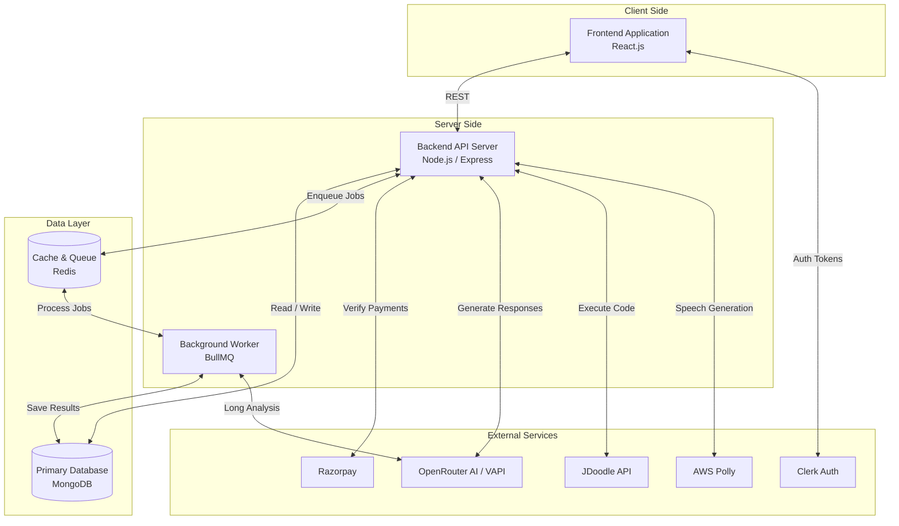
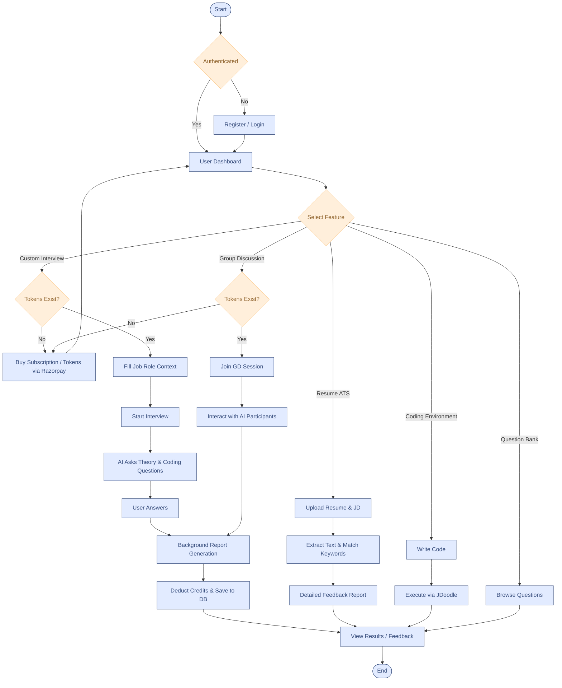
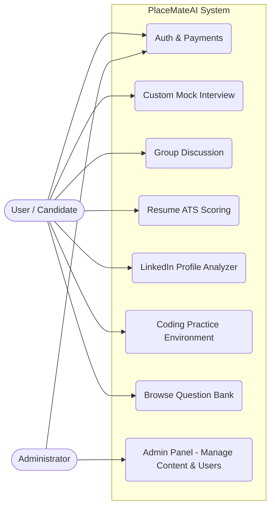
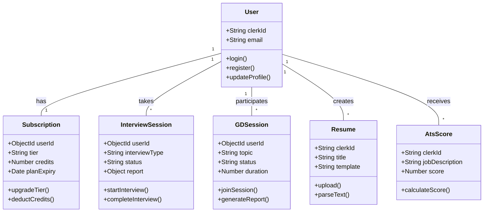

# InterviewMate - Project Diagrams

This document contains the core diagrams for the InterviewMate major project report, formatted using Mermaid.js.

## 1. Block Diagram (System Architecture)

This diagram illustrates the high-level architecture and components of the InterviewMate platform, including core AI processing and background queues.

## 2. Flow Chart (User Journey)

This flowchart represents the diverse feature set and typical user journeys across the platform.

## 3. Use Case Diagram

This diagram shows the interactions between the primary actors (User and Admin) and the application's major features.

## 4. Class Diagram

This diagram outlines the primary objects/classes within the backend system covering all major features.

## 5. ER Diagram (Entity-Relationship)

This diagram details the database schema and the entity relationships based on the actual backend models.

```mermaid
flowchart TD
    %% Entities
    User[USER]
    Sub[SUBSCRIPTION]
    Int[INTERVIEW_SESSION]
    GD[GD_SESSION]
    Res[RESUME]
    Ats[ATS_SCORE]

    %% Relationships
    Has{Has}
    Takes{Takes}
    Parts{Participates}
    Creates{Creates}
    Receives{Receives}

    %% Attributes for User
    U_Id([_id])
    U_Email([email])
    U_Status([status])
    U_Role([role])
    U_FName([firstName])

    User --- U_Id
    User --- U_Email
    User --- U_Status
    User --- U_Role
    User --- U_FName

    %% Attributes for Subscription
    S_Id([_id])
    S_Tier([tier])
    S_Credits([credits])
    S_Expiry([planExpiry])
    S_Cycle([billingCycle])

    Sub --- S_Id
    Sub --- S_Tier
    Sub --- S_Credits
    Sub --- S_Expiry
    Sub --- S_Cycle

    %% Attributes for InterviewSession
    I_Id([_id])
    I_Type([interviewType])
    I_Status([status])
    I_Dur([actualDuration])
    I_Vapi([vapiCallId])
    I_CAt([createdAt])

    Int --- I_Id
    Int --- I_Type
    Int --- I_Status
    Int --- I_Dur
    Int --- I_Vapi
    Int --- I_CAt

    %% Attributes for GDSession
    G_Id([_id])
    G_Topic([topic])
    G_Duration([duration])
    G_Status([status])
    G_Cat([category])
    G_Limit([timeLimit])

    GD --- G_Id
    GD --- G_Topic
    GD --- G_Duration
    GD --- G_Status
    GD --- G_Cat
    GD --- G_Limit

    %% Attributes for Resume
    R_Id([_id])
    R_Title([title])
    R_Temp([template])
    R_CAt([createdAt])
    R_UAt([updatedAt])

    Res --- R_Id
    Res --- R_Title
    Res --- R_Temp
    Res --- R_CAt
    Res --- R_UAt

    %% Attributes for AtsScore
    A_Id([_id])
    A_Desc([jobDescription])
    A_Score([score])
    A_FName([resumeFileName])
    A_CAt([createdAt])

    Ats --- A_Id
    Ats --- A_Desc
    Ats --- A_Score
    Ats --- A_FName
    Ats --- A_CAt

    %% Connections
    User ---|1| Has
    Has ---|1| Sub

    User ---|1| Takes
    Takes ---|N| Int

    User ---|1| Parts
    Parts ---|N| GD

    User ---|1| Creates
    Creates ---|N| Res

    User ---|1| Receives
    Receives ---|N| Ats

    %% Styling
    classDef entity fill:#9CCC65,stroke:#333,stroke-width:1px,color:#000
    classDef relationship fill:#FFA726,stroke:#333,stroke-width:1px,color:#000
    classDef attribute fill:#4DD0E1,stroke:#333,stroke-width:1px,color:#000

    class User,Sub,Int,GD,Res,Ats entity
    class Has,Takes,Parts,Creates,Receives relationship
    class U_Id,U_Email,U_Status,U_Role,U_FName,S_Id,S_Tier,S_Credits,S_Expiry,S_Cycle,I_Id,I_Type,I_Status,I_Dur,I_Vapi,I_CAt,G_Id,G_Topic,G_Duration,G_Status,G_Cat,G_Limit,R_Id,R_Title,R_Temp,R_CAt,R_UAt,A_Id,A_Desc,A_Score,A_FName,A_CAt attribute
```

